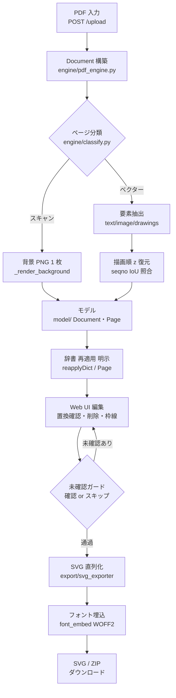
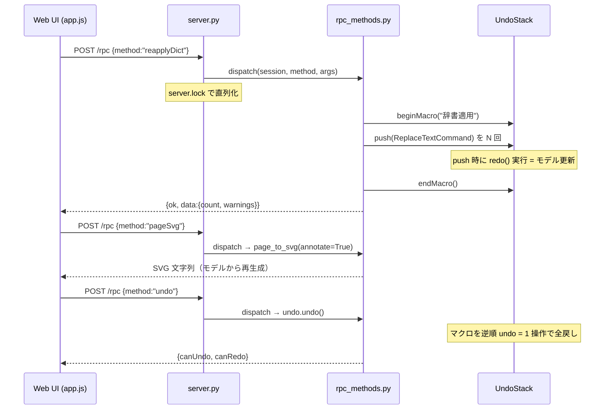
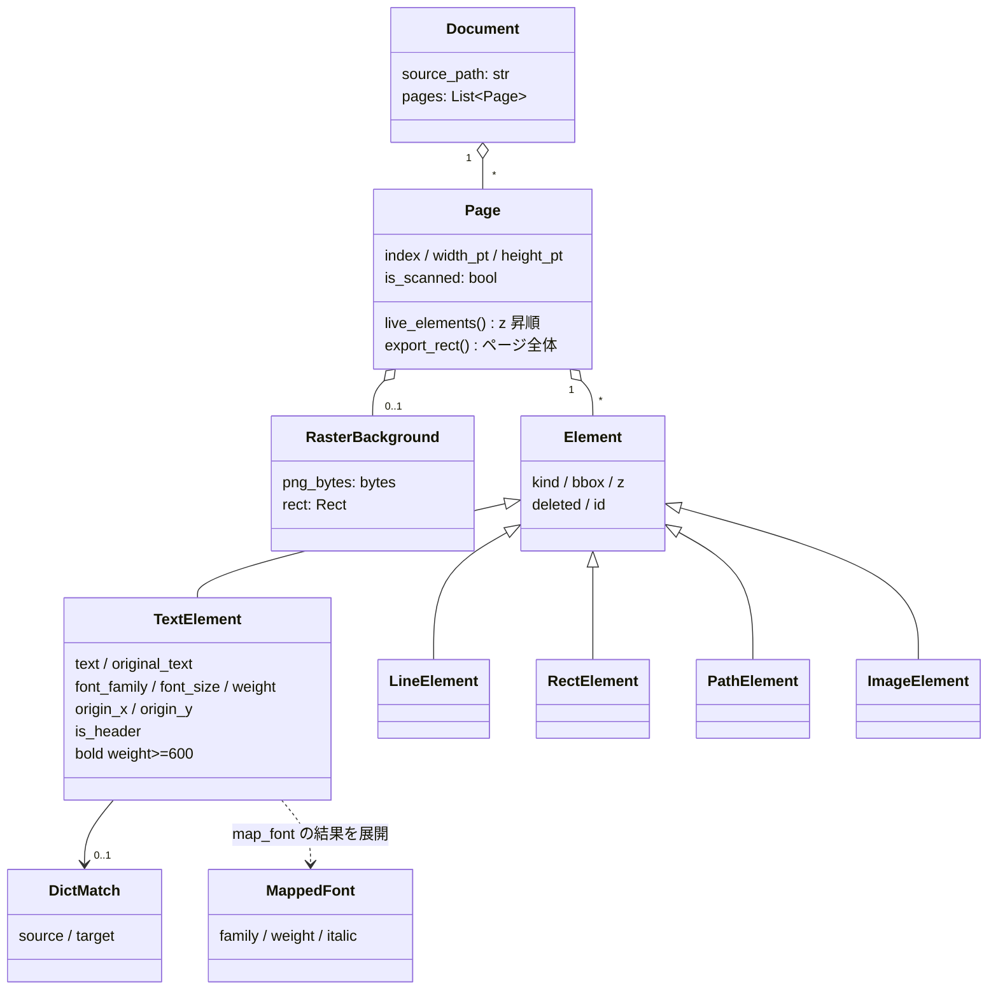
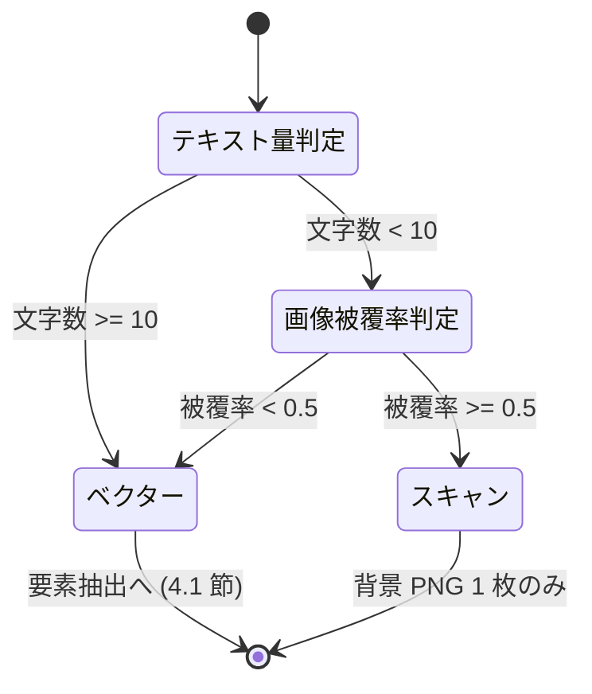

本書は PdfToSvg の実装構造・依存・ライフサイクルを、Python にまだ慣れていない読者でも実装を追えるところまで掘り下げて記述する。対象リビジョンは最新版。本文中のコード抜粋はすべて実ソースからの引用で、引用元をパスで示す。

# 1. 用語解説

| 用語 | 意味 |
|---|---|
| model is truth | 「編集状態の正はモデル（Python のデータ構造）にあり、画面は写しにすぎない」という設計原則。SVG は常にモデルから再生成する。 |
| dataclass（Python） | `@dataclass` を付けたクラス。属性宣言だけでコンストラクタ等が自動生成される。モデル層の全クラスが採用。 |
| RPC | Remote Procedure Call。ここでは Web UI から `POST /rpc` に `{method, args}` を送ってサーバ側の関数を呼ぶ仕組み。 |
| コマンドパターン | 編集操作を「redo()（実行）と undo()（取り消し）を持つオブジェクト」として表す設計。Undo/Redo の実装単位になる。 |
| Undo スタック / マクロ | 実行済みコマンドの積み上げ。マクロは複数コマンドを 1 束にして「1 操作 = 1 Undo」にする仕組み。 |
| 論理削除 | 要素をリストから消さず `deleted=True` の印を付けて非表示にする削除。Undo で戻せる。 |
| z 順 | 描画の重なり順。PDF の描画順を保持し、SVG でも同じ順に並べることで塗り重ねを再現する。 |
| NFKC 正規化 | Unicode の互換正規化。全角英数と半角英数、㌢ と センチ のような表記ゆれを同一視できる形に揃える。 |
| ベースライン | 文字が乗る基準線。PDF のテキスト座標はベースライン原点で表される。 |
| WOFF2 サブセット | フォントから使用文字だけを抜き出した軽量フォント。SVG に base64 で埋め込む。 |
| onedir（PyInstaller） | exe と依存 DLL 群をフォルダ一式で配布する形式。単一 exe（onefile）より起動が速い。可変データはフォルダ内ではなくユーザープロファイル配下に置く（9.1 節）。 |
| アプリモード（Edge） | `msedge.exe --app=<URL>` によるアドレスバー無しの 1 窓表示。デスクトップアプリの見た目になる。 |
| IoU | Intersection over Union。2 矩形の重なり具合（0〜1）。描画順の照合に使う。 |
| seqno | PyMuPDF が返す描画順の連番。テキスト span と突き合わせて z 順（描画順）を復元する材料になる。 |

# 2. アーキテクチャ

設計原則は**「モデルが真実（model is truth）」**。編集は Web UI から `/rpc` 経由でコマンドを Undo スタックへ push してモデルを更新し、SVG はモデルから直接書き出す（決定的・GUI 非依存でユニットテスト可能）。


PDF 入力から SVG 出力までの処理の流れ（アクティビティ図）。辞書置換は `/upload` では行わず、
Web UI の再適用ボタン（既定は表示中ページのみ、全ファイルは明示選択）からの Undo 可能な
コマンドとしてのみ積まれる。未確認ガード（8 章）は書き出しの手前に立つ:

<!-- ノードラベルは短い 2 行構成（改行は <br/>）。長い 1 行は CJK 幅の過小計算で枠外へ見切れる。 -->



## 2.1 操作 1 回のシーケンス（用語置換の例）

ユーザーが PDF を開いてから置換結果を目にするまで、データは次の 1 方向に流れる。

1. UI が `POST /upload` へ PDF バイト列を送る → `loader.load_document_bytes` が一時ファイル経由で `pdf_engine.load_document` を呼び、`Document`（モデル）を構築する（辞書はここでは適用しない）。
2. ユーザーが辞書タブの再適用ボタンを押す → `reapplyDictPage`（既定・表示中ページのみ）/ `reapplyDict`（全ファイル・明示選択）が「ヘッダ検出 → 置換計画 → 適用」を行う。適用は `ReplaceTextCommand` 群を**マクロ**として Undo スタックへ push する（1 回の再適用 = 1 Undo）。
3. UI が `pageSvg` RPC を呼ぶ → `svg_exporter.page_to_svg(page, annotate=True)` が**モデルから** SVG を生成して返し、UI がそのまま表示する。
4. 以降の編集（削除・枠線等）も同じ形: RPC → コマンド生成 → Undo スタックへ push（push 時に `redo()` が走りモデルが変わる）→ UI が SVG を取り直す。
5. `undo` / `redo` RPC はスタック上のコマンドの `undo()` / `redo()` を呼ぶだけ。画面は毎回モデルから再生成されるので、モデルと画面がずれることがない。

辞書の再適用（`reapplyDict`）から Undo までの往復をシーケンス図で示す。`/rpc` は `server.lock`
で直列化され、置換 N 件はマクロ 1 束（= 1 Undo）として積まれる（7 章）:



## 2.2 モジュール構成

| パス | 責務 | 章 |
|---|---|---|
| `src/app.py` | エントリポイント。Edge 探索・アプリ窓起動・ライフサイクル管理 | 10 |
| `src/config.py` | パス解決（frozen exe / ソース実行の双方）。data/・fonts/・resources/ の基準 | 10 |
| `src/engine/pdf_engine.py` | PyMuPDF で PDF を抽出し Document モデルへ | 4 |
| `src/engine/classify.py` | ベクター / スキャン（画像主体）ページの判定 | 4 |
| `src/model/document.py`, `elements.py` | Document / Page / 各 Element（Text/Line/Rect/Path/Image） | 3 |
| `src/model/fonts.py` | PDF フォント名 → Windows 標準 / 同梱フォントへのマッピング、ウェイト保持 | 3 |
| `src/export/svg_exporter.py` | モデル → SVG 文字列の決定的シリアライズ | 5 |
| `src/export/font_embed.py` | fontTools によるサブセット化 + base64 WOFF2 @font-face 埋め込み | 5 |
| `src/dictionary/store.py` | 辞書の JSON 永続化（add/upsert/update/delete/all/lookup/import/export） | 6 |
| `src/dictionary/apply.py` | ヘッダ検出・置換適用・折返しヘッダの畳み込み | 6 |
| `src/dictionary/normalize.py` | NFKC 正規化（全角/半角差の吸収） | 6 |
| `src/web/server.py` | ローカル HTTP サーバ（静的配信 + /rpc + /upload + /quit + /ping） | 7 |
| `src/web/rpc_methods.py` | RPC 実体。WebSession が複数 PDF・辞書・Undo を保持 | 7 |
| `src/web/commands.py`, `undo_stack.py` | コマンドパターン（Delete/ReplaceText/AddElement）と純 Python Undo | 7 |
| `src/web/loader.py` | PDF バイト列 → Document（一時ファイル経由） | 7 |
| `resources/web/` | Edge アプリ窓の UI（index.html / app.js / rpc.js / dom.js / geometry.js） | 8 |
| `fonts/` | 同梱フォント（BIZ UDPゴシック / Noto Serif JP, SIL OFL） | 9 |
| `packaging/pdftosvg.spec` | PyInstaller 設定（Qt 除外・fonts/resources 同梱） | 10 |
| `test/` | pytest（engine/model/dictionary/export/web）+ Playwright E2E | 13 |

# 3. モデル層 model/

主要クラスの関係をクラス図で示す（`src/model/document.py` / `elements.py` / `fonts.py`）。
`Document` → `Page` → `Element` の素直なコンテナ階層で、描画要素 5 種はすべて基底 `Element` の
派生。`MappedFont` はフォントマッピング（3.3 節）の結果値で、モデルには保持されず
`TextElement.font_family` / `weight` / `italic` へ展開される:



## 3.1 Element クラス群（`src/model/elements.py`）

すべての描画要素は基底 `Element` を継承した dataclass。共通属性は「種別・外接矩形・描画順・論理削除フラグ・ID」の 5 つだけ:

```python
@dataclass
class Element:
    """全要素の基底。"""
    kind: str = "element"
    bbox: Rect = field(default_factory=lambda: Rect(0, 0, 0, 0))
    z: int = 0
    deleted: bool = False
    id: int = field(default_factory=new_id)
```

派生クラスと固有属性:

| クラス | kind | 固有属性 |
|---|---|---|
| `TextElement` | `"text"` | `text`, `original_text`（置換前・Undo/レビュー用）, `font_family`, `font_size`, `weight`（CSS 100–900）, `italic`, `color`, `origin_x/origin_y`（ベースライン原点）, `is_header`, `dict_match`, `invisible`（PDF の文字描画モード 3/7 由来。既定 false）, `manual_cover`（手順 3「上書き」ツールで置いた要素か。既定 false） |
| `LineElement` | `"line"` | `x0, y0, x1, y1`, `width`, `color` |
| `RectElement` | `"rect"` | `rect`, `stroke`, `fill`, `stroke_width` |
| `PathElement` | `"path"` | `d`（SVG path 文字列）, `stroke`, `fill`, `stroke_width` |
| `ImageElement` | `"image"` | `rect`, `img_bytes`, `ext`（"png"/"jpeg"）, `clip_d`（PDF のクリップパス由来の切り抜き形状。SVG path の `d` 文字列で、空文字列はクリップ無し） |

中心となる `TextElement` の実定義（`src/model/elements.py`）:

```python
@dataclass
class TextElement(Element):
    kind: str = "text"
    text: str = ""
    original_text: str = ""  # 辞書置換前の値 (Undo / レビュー用)
    font_family: str = "sans-serif"
    font_size: float = 12.0
    weight: int = 400  # CSS フォントウェイト (100-900)。元 PDF のウェイトを保持
    italic: bool = False
    color: str = "#000000"
    origin_x: float = 0.0  # ベースライン原点 (SVG <text> の x)
    origin_y: float = 0.0
    is_header: bool = False
    dict_match: Optional[DictMatch] = None
    invisible: bool = False       # PDF の文字描画モードが 3(描かない)/7(クリップのみ) の文字
    manual_cover: bool = False    # 手順 3「上書き」ツールで置いた要素か

    @property
    def bold(self) -> bool:
        """太字相当か (weight>=600)。weight を単一ソースとする。"""
        return self.weight >= 600
```

- `original_text` は `__post_init__` で初期値が自動コピーされる。置換後も元の値が残るため、「変更箇所の一覧」や Undo の材料になる。
- `bold` を独立フラグにせず `weight >= 600` の導出プロパティにしている点に注目（真実は weight ひとつ）。
- `invisible` はスキャン画像の上に OCR 結果を透明で重ねた「検索可能 PDF」の文字層を表す（4.1 節）。値は抽出時に一度だけ決まり、置換や戻しでは変わらないため、辞書の Undo が控える復元情報（`DictRevertInfo`）には含まれない。`manual_cover` は手順 3「上書き」ツールで利用者が範囲をドラッグして置いた要素を表し、`invisible=True` と `dict_match` 付きを常に伴って自動置換と同じ描画経路（5.1 節）へ乗るが、辞書由来ではないため確認一覧（`planPage`）や辞書の戻しの対象にはしない（7.2 節）。

## 3.2 Document / Page（`src/model/document.py`）

`Document` は `source_path` + `pages`、`Page` はページ寸法と要素リストを持つだけの素直な構造:

```python
@dataclass
class Page:
    index: int
    width_pt: float
    height_pt: float
    is_scanned: bool = False
    background: Optional[RasterBackground] = None
    elements: List[Element] = field(default_factory=list)

    def live_elements(self) -> List[Element]:
        """削除されていない要素 (z 昇順)。"""
        items = [e for e in self.elements if not e.deleted]
        return sorted(items, key=lambda e: e.z)

    def export_rect(self) -> Rect:
        """書き出し領域 (ページ全体)。"""
        return Rect(0, 0, self.width_pt, self.height_pt)
```

「model is truth」の実現はこの 2 メソッドに集約される。削除は要素を消さず `deleted=True` の**論理削除**（Undo 可能）、描画・書き出しは常に `live_elements()`（削除除外・z 昇順）を読む。`export_rect()` は常にページ全体で、クロップ（切り抜き）という概念は持たない。UI の「範囲削除」は矩形内要素の一括論理削除である。

## 3.3 フォントマッピング（`src/model/fonts.py`）

PDF 内のフォント名（例 `BIZ-UDPGothic-Bold`、サブセット接頭辞付き `ABCDEF+MS-Gothic` 等）を、表示可能なフォントへ写像する。中心は `map_font`:

```python
def map_font(pdf_name: str, text: str = "") -> MappedFont:
    key = _norm(pdf_name)                       # 小文字化 + 空白/-/_/, 除去
    hit = _EXACT.get(key)                        # 完全一致表を引く
    weight: Optional[int] = None
    italic = False
    if hit is None:
        base, weight, italic = _strip_style(key) # 末尾スタイルトークン剥がし
        hit = _EXACT.get(base)                    # 基底名で再照合
    if hit is not None:
        resolved = weight if weight is not None else hit.weight
        return MappedFont(hit.family, resolved, hit.italic or italic)
    generic, ja_hint = _classify(pdf_name)        # 未知名を種別推定
    script = "ja" if (ja_hint or contains_japanese(text)) else "latin"
    return MappedFont(_DEFAULTS[(script, generic)], weight or 400, italic)
```

手順: (1) 名前を正規化して完全一致表（PDF 標準 14 フォント・欧文エイリアス・Windows 標準和文・有料和文フォント）を引く → (2) 外れたら `Bold` / `W6` / `Italic` 等の末尾スタイルトークンを剥がして基底名で再照合（剥がしたトークンはウェイト・イタリックとして反映）→ (3) それでも未知なら serif / sans / mono と和文ヒントを推定し、既定フォントへフォールバック。有料・非搭載の和文フォント（ヒラギノ等）は同梱の `BIZ UDPGothic` / `Noto Serif JP` へ寄せる。

付随ヘルパー: `needs_embedding`（同梱フォントのみ埋込対象）、`is_variable_family`（Noto Serif JP は可変フォント）、`static_weight_bucket`（BIZ UDPGothic は 400/700 の 2 バケットへ丸め）、`fallback_css`（和文テキスト + 欧文ファミリ時に和文フォントをフォールバック連結）、`is_width_overflow`（置換後の幅超過警告。全角=1em・半角=0.5em の概算）。

## 3.4 図検出（`src/model/figure_detect.py`）

運用報告書に毎号掲載される「当社のスチュワードシップ活動」の図（螺旋の概念図）だけを、幾何の指紋（曲線の本数等）ではなく**文字アンカー**で見つける純粋関数。号・ファンドごとに掲載ページも位置も違う一方、見出しと図内ラベルの文言は共通しているため、この方式を採る。`Page.live_elements()` の bbox と文字列だけを見る（PyMuPDF に非依存。合成 `Page` で単体テストできる）。

`detect_stewardship_figure(page) -> Rect | None` の判定手順:

1. **見出し**: 文字要素の `text` を NFKC 正規化し空白を除いた上で `当社のスチュワードシップ活動`（`STEWARDSHIP_HEADING`）を含む要素を探す。無ければ `None`。
2. **図ラベル**: 見出しより下（`bbox.y > 見出し.y`）で、幅がページ幅の 50%（`LABEL_MAX_WIDTH_RATIO`）未満の文字要素のうち、次のキーワード（`STEWARDSHIP_LABELS`）のいずれかを含むものを集める。
   `投資リターンの最大化` / `エンゲージメント` / `議決権行使` / `ESGの考慮` / `フィデューシャリー` / `stewardship_initiatives`。
   幅の条件は、同じ語が並ぶ直後の本文段落（ページ幅いっぱいの行）を誤って取り込まないためのもの（実 PDF では URL ラベルが幅 45.4%、本文段落は 84% 以上）。ラベルが `MIN_LABEL_HITS`（3 件）未満なら `None`（見出しだけで図が無い、または文言が大きく変わったと判断する）。
3. **領域**: ラベルの bbox を合併した矩形から始め、近傍 `FIGURE_EXPAND_TOL`（16pt）に触れる図形・画像（`RectElement` / `PathElement` / `LineElement` / `ImageElement`）を不動点まで取り込む。ただし面積がページの 50%（`BACKGROUND_AREA_RATIO`）以上の要素（ページ背景）と、幅がページ幅の 90%（`BAND_WIDTH_RATIO`）以上の要素（ヘッダ帯・区切り罫）は取り込まない。
4. 最後に、領域に交差する幅 50% 未満の文字要素（ラベルの説明文）を取り込む。

返す矩形は 1 ページにつき最大 1 個。同じページに 2 回載ることは想定しない。

キーワード集合と見出しは `figure_detect.py` の定数 1 箇所（`STEWARDSHIP_HEADING` / `STEWARDSHIP_LABELS` / `MIN_LABEL_HITS = 3` / `FIGURE_EXPAND_TOL = 16` / `LABEL_MAX_WIDTH_RATIO = 0.5`）にまとめてある。将来別の図を狙うなら定数集合を増やす構造にするが、現状は 1 集合のみの実装。

資源上限: 要素数は既存の `MAX_PAGE_ELEMENTS` の範囲内。不動点ループは「取り込んだ要素は二度と候補にしない」形で書き、反復回数を要素数で上界する（必ず返る）。

設計時に PyMuPDF 直叩きの試作で運用報告書 5 本（80 ページ）を検査し、該当ページを 1 つずつ検出、他 75 ページの誤検出はゼロだった（掲載ページは 7〜10 ページ目と本ごとに異なる）。これらの実 PDF は外部著作物のためテストフィクスチャには含めず、テストは合成 `Page` で行う（13 章）。

# 4. 変換エンジン engine/

## 4.1 抽出手順（`src/engine/pdf_engine.py`、PyMuPDF）

`load_document` が各ページを `_extract_page` にかける。手順:

1. `fitz.open(path)` で PDF を開き、ページを走査する。
2. **スキャン判定**（4.2 節）。スキャンページなら `get_pixmap(matrix=2 倍)` で PNG 背景画像 1 枚を作って終了（要素抽出しない）。
3. **描画順（z）復元の下ごしらえ**: `get_texttrace()` から文字列描画の連番（seqno）を、`get_bboxlog()` から画像系描画の位置を集める。
4. **テキスト / 画像ブロック**: `page.get_text("dict")` のブロックを走査し、テキスト span を `_text_element` で `TextElement` に、画像ブロックを `ImageElement` にする。span と seqno の対応付けは **IoU 最大**で照合する（面積最大だと巨大 span が小さい span を吸ってしまうため）。画像には**クリップ形状**を紐づける（下記 5 の `_clip_index` から `_clip_path_for` で引き当てる。4.3 節）。
5. **ベクター描画とクリップ**: `page.get_drawings(extended=True)` を 1 回だけ走査する。`type` が `"f"`/`"s"`/`"fs"` の描画は、線分を `LineElement`、矩形を `RectElement`、それ以外の複合パスを SVG path の `d` 文字列にして `PathElement` にする。`type="clip"` の項目は要素にせず、`scissor` 矩形をキーにした索引（`_clip_index`）へ畳んで 4 の画像へ紐づける（詳細は 4.3 節）。`extended=True` にしても `"f"`/`"s"`/`"fs"` の内容は従来と一致するので、描画の取得は 1 回にまとめている（2 回呼ぶと 1 ページ数百件の走査が二重になる）。
6. **色**: span 色は sRGB 整数 → `#rrggbb`、drawings 色は 0..1 の float → `#rrggbb` へ変換する（`engine/colors.py`）。

テキスト 1 個の変換（`src/engine/pdf_engine.py`）:

```python
def _text_element(span: dict, z: int, invisible: bool = False) -> Optional[TextElement]:
    text = sanitize_text(span.get("text", ""))
    if text == "" or text.isspace():
        return None
    bbox = span["bbox"]
    origin = span.get("origin", (bbox[0], bbox[3]))
    flags = span.get("flags", 0)
    raw_font = _clean_font(span.get("font", "sans-serif"))
    mapped = fonts.map_font(raw_font, text)
    weight = mapped.weight
    if (flags & FLAG_BOLD) and weight < 600:   # 名前に重み指定が無い時のみ持ち上げ
        weight = 700
    return TextElement(
        bbox=Rect.from_xyxy(*bbox), z=z, text=text,
        font_family=mapped.family,
        font_size=float(span.get("size", 12.0)), weight=weight,
        italic=bool(flags & FLAG_ITALIC) or mapped.italic,
        color=int_to_hex(span.get("color", 0)),
        origin_x=origin[0], origin_y=origin[1],
        invisible=invisible,
    )
```

`invisible` は呼び出し側（`_extract_page`）が seqno 照合の結果から渡す引数で、PDF の文字描画モードが
3（描かない）/ 7（クリップのみ）の span を表す。この関数自体は描画モードを見ず、判定は 4.1 節の
`_invisible_seqnos` が持つ。

> [!WARN] `pdf_engine.py` は **AGPL ライセンスの PyMuPDF** に依存する唯一のモジュール（14 章）。差し替え候補（pypdfium2）を見据えて、PyMuPDF への依存はこのファイルに閉じている。

**不可視 OCR 文字層の検出**: スキャン画像の上に OCR 結果の文字を透明（PDF の文字描画モード 3 =
描かない・7 = クリップのみ）で重ねた「検索可能 PDF」は、文字数が `MIN_TEXT_CHARS` を超えるため
4.2 節の判定でベクター扱いになる。`get_text("dict")` の span は描画モードを持たないので、
`get_texttrace()` の `type` を seqno ごとに集め、**全エントリが不可視モードの seqno だけ**を
「不可視」とする（`_invisible_seqnos`。可視と不可視が混在する seqno は可視側へ倒し、本物の文字を
誤って消さない）。span の seqno 照合（4 の IoU 照合）自体は変えず、照合できた seqno でこの集合を
引いて `TextElement.invisible` を立てる。**照合失敗（既定値へフォールバック）と `_SeqnoIndex` が
`degraded`（索引の構築を諦めた状態）のときも可視のまま**にする。`degraded` のときは `_invisible_seqnos`
自体を呼ばず、空集合をそのまま渡す。`_SeqnoIndex.match` は `degraded` なら常に既定値（照合失敗と
同じ扱い）を返すため、不可視かどうかの判定はどのみち一度も使われない。使われない集合を作る手間を
省いておくのは、索引側の「上限に当たったら諦めて回し続けない」という規律にそのまま揃えたもので
ある。これらはいずれも「不可視と誤判定すると本物の文字が書き出しから消える」側のフォールバック
なので、判定に迷ったら可視へ倒す。

## 4.2 スキャン判定（`src/engine/classify.py`）

「テキストがほぼ無い、かつ画像がページの半分以上を覆う」の AND 条件でスキャンページと判定する。どちらか一方でも弱ければベクター扱い（テキスト編集を優先）:

```python
MIN_TEXT_CHARS = 10          # これ未満ならテキストほぼ無し
IMAGE_COVERAGE_RATIO = 0.5   # 画像がページ面積のこれ以上を覆えば画像主体

def is_scanned_page(page: "fitz.Page") -> bool:
    text = page.get_text("text").strip()
    if len(text) >= MIN_TEXT_CHARS:
        return False                          # 文字が十分 → ベクター
    page_area = abs(page.rect.width * page.rect.height)
    if page_area <= 0:
        return False
    image_area = 0.0
    for info in page.get_image_info():
        bbox = info.get("bbox")
        if bbox:
            r = fitz.Rect(bbox)
            image_area += abs(r.width * r.height)
    coverage = image_area / page_area
    return coverage >= IMAGE_COVERAGE_RATIO    # 両条件成立でスキャン
```

判定の遷移を状態遷移図で示す。しきい値は `MIN_TEXT_CHARS = 10`（文字数）と
`IMAGE_COVERAGE_RATIO = 0.5`（画像被覆率）の 2 つで、**両条件が成立したときだけ**スキャン扱いに
なる（迷ったらベクター = テキスト編集を優先）:



## 4.3 画像のクリップ形状（`_clip_index` / `_clip_path_for`）

PDF は「グラデーション（Shading）を任意の形のクリップパスで切り抜いて描く」ことができる。ところが
`page.get_text("dict")` はそのシェーディングを **bbox サイズのラスタ画像**として返し、**クリップ形状は
返さない**。そのまま bbox の矩形へ貼ると、切り抜きを失った不透明な矩形が下の図形を覆い隠す（実例:
螺旋図が「四角形が積み重なった図形」になる）。

そこで `page.get_drawings(extended=True)` が返す `type="clip"` の項目を使い、切り抜き形状を
`ImageElement.clip_d`（SVG path の `d` 文字列）としてモデルへ載せる。SVG 側は同一形状ごとに 1 個の
`<clipPath>` を `<defs>` へまとめ、各 `<image>` から `clip-path="url(#...)"` で参照する（5.1 節）。

**引き当ての規則**:

- clip の `scissor` 矩形と画像ブロックの bbox を、**小数第 1 位で丸めた 4 つ組**で厳密一致させる。
  索引（`dict`）を引くだけにして線形走査を避ける — 画像数も clip 数も PDF 作成者が決めるため、
  総当たりでは O(n²) が素通りする（`_SeqnoIndex` と同じ理由）。
- **items が矩形 1 個だけの clip は索引へ入れない**。画像 bbox と同一の矩形で切り抜きの効果が無く
  （ページ全体を覆う既定のクリップがこの形）、拾うと無意味な `<clipPath>` が画像の数だけ増える。
  **items が空の clip も入れない**（切り抜く形が無い）。
- 候補が複数あるときは `level` 降順に走査し、**最初に使えた 1 個**を採る。`<clipPath>` はサブパスを
  足すと**和集合**になり入れ子クリップの交差にはならないので、複数を 1 個へ畳むと切り抜きが広がる。
  降順走査にしているのは、`level` 最大の候補が使えないとき（下記の上限超）に**下位候補へ落とす**ため
  である。ここを「最大の 1 個を選んでから判定」にすると、劣化候補が有効候補を隠して上記のバグが
  無言で再発する。
- item 数は `MAX_CLIP_ITEMS`（1,000）で切り、超過した候補は飛ばす。どれも使えなければ
  **クリップ無しへ degrade** する（読み込み自体は止めない）。クリップの item 数は PDF 作成者が
  決められるため、巨大なパスで `d` 文字列を膨らませられないようにする。

引き当ては幾何一致のみで、clip の描画順スコープと画像の描画順は突き合わせていない（heuristic）。
外れたときの結果は「クリップ無し = 従来出力」で安全側に倒れる。

# 5. SVG エクスポート export/

## 5.1 決定的直列化（`src/export/svg_exporter.py`）

`page_to_svg(page, annotate=False)` の手順:

1. `page.export_rect()`（ページ全体）から `<svg>` の `width` / `height` / `viewBox`（常に `0 0 width height`）を出力する。数値は `f"{v:.3f}"` の末尾ゼロ除去で正規化し、表記ゆれを排除する。
2. スキャン背景があれば先頭に `<image>`（base64 PNG）。
3. `live_elements()`（削除除外・**z 昇順**）を関数の中で 1 度だけ確定させ（`live`）、この順に直列化する。要素の出力順 = z 順なので、同一モデルからは常に同一の SVG が出る（決定的出力）。`live_elements()` は呼ぶたびに絞り込みと並べ替えをやり直すため、直後の `<defs>` のクリップ形状収集・本節のこの直列化ループ・後述の `_cover_sampler` の 3 箇所は同じ `live` を参照する（呼び出しごとに計算し直さない）。
4. `annotate=True` のときだけ各タグへ `data-el="<id>"` を付ける。これは Web UI が「クリックした SVG 要素 → モデル要素」を対応付けるための編集用注釈で、**書き出し（`exportSvg`）は `annotate=False`** のため成果物には残らない。
5. 使用フォントの `@font-face` CSS（5.2 節）を `<style>` として挿入する。

`clip_d` を持つ画像（4.3 節）があるときは、要素の直列化に先立って `<defs>` へ `<clipPath>` をまとめて
出し、各 `<image>` は `clip-path="url(#...)"` で参照するだけにする。`<clipPath>` の id は `d` 文字列の
ダイジェスト由来（`_image_clip_id`）なので、同じ形状は 1 個の定義を共有し、同一モデルからは常に同じ
id が出る（決定的出力）。**要素の直列化を `<defs>` で始めない**のがこの分離の理由で、`_with_data_el` は
開きタグの最初の空白へ属性を差し込むため、`<defs>` で始めると `data-el` が `<defs>` に付いてしまう。
`clip_d` が空のときは `<defs>` も `clip-path` も出ないので、**従来の出力とバイト単位で一致する**。

テキストの直列化には据え方の 3 分岐がある。未編集は元 PDF のベースライン原点に置く（従来出力と完全一致）。単独行の置換は元と幅が違うため、元のベースラインに置くと表のセル内で上下にずれて見える。そこで外接箱の縦中央へ据え直す。折返し畳み込みの置換（`wrap_align` 設定済み）は、縦は**下揃え**（`origin_y` は最終行のベースラインへ据え直し済み）、横は**元の折返し行の揃え**（左/中央/右）を `text-anchor` で踏襲する。全幅への引き伸ばしはせず、合成領域の幅を超える恐れがあるときだけ `textLength` で圧縮する:

```python
def _text_to_svg(el: TextElement) -> str:
    family = fonts.fallback_css(el.font_family, el.text)
    weight = f' font-weight="{el.weight}"' if el.weight != 400 else ""
    style = ' font-style="italic"' if el.italic else ""
    stretch = ""
    if el.bbox.w > 0:
        stretch = f' textLength="{_fmt(el.bbox.w)}" lengthAdjust="spacingAndGlyphs"'
    if el.text == el.original_text:
        x, y, base = el.origin_x, el.origin_y, ""      # 未編集: 元ベースライン
        punct = _fullwidth_punct_anchor(el.text) if el.bbox.w > 0 else None
        if punct is not None:                          # 全角約物 1 文字: 字面の寄せを復元
            stretch = ""
            if punct == "end":
                x, base = el.bbox.x1, ' text-anchor="end"'
            elif punct == "middle":
                x, base = el.bbox.x + el.bbox.w / 2, ' text-anchor="middle"'
    elif el.wrap_align is not None:
        y, base = el.origin_y, ""                       # 折返し畳み込み: 下揃え
        if el.wrap_align == "center":
            x, base = el.bbox.x + el.bbox.w / 2, ' text-anchor="middle"'
        elif el.wrap_align == "right":
            x, base = el.bbox.x1, ' text-anchor="end"'
        else:
            x = el.bbox.x                               # 左揃え (既定 anchor)
        if not fonts.is_width_overflow(el.text, el.font_size, el.bbox.w):
            stretch = ""                                # 幅超過時のみ圧縮
    else:
        x = el.bbox.x
        y = el.bbox.y + el.bbox.h / 2                   # 単独行の置換: 箱の縦中央
        base = ' dominant-baseline="central"'
    return (
        f'<text x="{_fmt(x)}" y="{_fmt(y)}"{base} '
        f'font-family={quoteattr(family)} font-size="{_fmt(el.font_size)}" '
        f'fill="{el.color}"{weight}{style}{stretch}>'
        f'{escape(sanitize_text(el.text))}</text>'
    )
```

`textLength` + `lengthAdjust="spacingAndGlyphs"` により、置換後の文字列も元の幅に収まるよう字間・グリフが自動調整される。

未編集テキストの唯一の例外が**全角約物 1 文字**（`_fullwidth_punct_anchor`）である。元 PDF が等幅の和文フォントで組まれていると、開き約物は全角枠の右半分に、閉じ約物と句読点は左半分に字面が来る前提で座標が付く。実際、三井住友トラスト・アセットマネジメントの運用報告書では `］`（x=353.3）と `［`（x=352.3）の全角枠がほぼ完全に重なっている。ところが同梱の BIZ UDPGothic はプロポーショナルで約物の字面を枠の左へ詰めるため、そのまま原点へ置くと 2 つが同じ位置に落ちて 1 つの塊に潰れる。さらに `textLength` で全角幅へ引き伸ばすと、`lengthAdjust="spacingAndGlyphs"` がグリフ自体を倍幅にするので潰れがより濃くなる。

そこで全角約物 1 文字に限り、幅合わせ（`textLength`）をやめて字面の寄せだけを `text-anchor` で復元する。寄せる向きは Unicode の一般カテゴリで決まるので、文字を列挙しない。開き（`Ps` / `Pi`）は箱の右端へ `end`、中黒（`・`）は箱の中央へ `middle`、閉じ（`Pe` / `Pf`）と句読点（`Po`）は原点のまま（既定の `start`）である。2 文字以上・半角の約物・約物でない全角 1 文字は従来どおり `textLength` を付ける。

### 不可視 OCR 文字の 3 分岐と `export/cover.py`

`TextElement.invisible`（4.1 節）を持つ要素は、`_element_to_svg` の通常経路には乗らず、`page_to_svg` が次の 3 通りに分ける:

| 状態 | `annotate=False`（書き出し） | `annotate=True`（編集画面） |
|---|---|---|
| 可視（従来） | 従来どおり `<text>` | 従来どおり `<text data-el>` |
| 不可視・未置換（`dict_match is None`） | 出さない | `<text fill-opacity="0" data-el>` |
| 不可視・置換済み | `<g><rect/><text/></g>` | `<g data-el><rect/><text/></g>` |

「置換済み」は `dict_match is not None` で判定するため、手動の上書き（8 章）もこの枝を通る。透明で描く `<text>` は `fill` を残したまま `fill-opacity="0"` を付ける（`fill="none"` だと SVG の既定 `pointer-events="visiblePainted"` が当たり判定から外すが、不透明度 0 は当たる。クリック取り込みと確認一覧のマーカーがそのまま効く）。`<g>` で包むのは、この分岐が `<rect>` と `<text>` の 2 つの子タグを出すためである。`_with_data_el` は「1 要素 = 1 開きタグ」を前提に、属性を持つ開きタグなら最初の空白へ、`<g>` のように属性の無い開きタグなら最初の `>` の位置へ `data-el` を差し込む（後者は本節の実装で `_with_data_el` に加えた分岐）。包まずに `<rect>` と `<text>` をそのまま並べると、この前提が崩れて `data-el` が先頭の `<rect>` にしか付かない。1 要素を `<g>` へ包んでおけば `data-el` は常にその 1 か所にだけ載り、`app.js` の `flashElement` / `highlightElement` / マーカー描画（`getBoundingClientRect` と `getBBox` を使う）は矩形・文字の両方を包む `<g>` を対象にできる。矩形は要素の `bbox` そのまま（折返し畳み込みなら合成領域）で、余白は足さない。文字の据え方は既存の置換枝（縦中央 `dominant-baseline="central"`、幅超過時のみ `textLength` で圧縮）を流用し、色だけ `el.color` を使わず採取した文字色に置き換える。埋め込みフォントの収集（`text_els`）は実際に `<text>` を出した要素だけを対象にし、書き出しで出さない不可視・未置換の要素は含めない。

矩形と文字の色は新設の `src/export/cover.py`（`fitz` 非依存、Pillow のみ）が決める:

```python
MAX_COVER_IMAGE_PIXELS = 16_000_000   # grayscale.MAX_GRAY_IMAGE_PIXELS と同値
QUANT_SHIFT = 4                        # 各チャンネル 16 階調
MIN_CONTRAST = 48

@dataclass(frozen=True)
class CoverColors:
    background: str   # "#rrggbb"
    foreground: str   # "#rrggbb"
    fallback: bool     # True = 採れずに白/黒へ倒した

def decode_image(img_bytes: bytes, ext: str) -> Optional[Image.Image]
def sample_colors(img: Optional[Image.Image], img_rect: Rect, bbox: Rect) -> CoverColors
```

- `decode_image` は画素数を `MAX_COVER_IMAGE_PIXELS` で切ってから `Image.open` する。超過・壊れた画像は例外を外へ出さず `None` を返す（1 枚の画像で書き出し全体を止めない）。
- `decode_image` は透過を持つ画像（`RGBA` / `LA` / `PA`、または透過付きパレット）を、`RGB` へ変換する前に白へ合成する。`convert("RGB")` を素通しすると alpha は合成されずに捨てられるだけなので、完全に透明な画素が格納 RGB（RGBA の PNG では黒であることが多い）のまま最頻色を支配し、隠すはずの矩形が黒い帯になる。部分透明の画素も白との混色にする（透明度を二値扱いにしない）。合成先を白にしているのは、採色経路がそもそも置いている「画像の下は紙」という前提と同じである。ただし書き出す SVG 自体にはページ全体を塗る白い矩形は無く背景は透明なので、白と仮定するのは閲覧側が紙 / 白地の環境で開くことに依った近似である。
- `sample_colors` は `bbox` を `img_rect` からの線形写像で画素座標へ変換し、画像の範囲でクランプする。範囲内の画素を各チャンネル `QUANT_SHIFT`（16 階調）に量子化して出現回数を数え、（件数の降順・量子化値の昇順）で並べる。**最頻色が背景**、**2 番目に多い色が文字色**の候補で、代表色は箱に入った画素の平均値（整数へ丸め）を使う（量子化の中心値だと白い紙が `#f8f8f8` になり実際の色とずれるため）。
- 2 番目の候補が無い、または背景色とのチャンネル差の最大が `MIN_CONTRAST` 未満（帯の上の白抜き文字のように 2 色しかない場合など）なら、背景の輝度（`grayscale._luma` と同じ ITU-R 601-2 式）が 128 以上で黒、未満で白を文字色にする。この倒しは背景色自体は採れているので `fallback=False`。
- 画像が渡されない・bbox が画像の外なら白背景 `#ffffff` / 黒文字 `#000000` の `fallback=True`。

`page_to_svg` 側の採取元の優先順位は「text の bbox 中心を含む `ImageElement` のうち z が最大のもの」→ 無ければスキャンページの `page.background`（`RasterBackground`。手動の上書きが下に画像を持たないスキャンページで使う）→ どちらも無ければ `fallback=True`。採取は `_cover_sampler(live, image_fn, background)` が担い、画像を渡す前に必ず `image_fn`（グレースケール時は `to_gray_image`、それ以外は恒等関数）へ通してから `cover.decode_image` へ渡す。矩形の色を**書き出しに乗る画像**から採るためで、元のカラー画像から採ると矩形は輝度変換だけを経て画像は `tone_curve` も掛かるため矩形だけが暗い当て板になる（設計正典に理由を記載）。デコード（`cover.decode_image`）自体は `page_to_svg` 1 回の呼び出しの中で画像ごとに 1 度だけ行い（要素 id をキーにしたローカル辞書）、呼び出しをまたぐキャッシュは持たない。ただしその手前の `image_fn` がグレースケール変換のときは、`to_gray_image` 自体が `functools.lru_cache(maxsize=16)` を持つ（5.3 節）ため、そちらはプロセス全体で書き出しをまたいで共有される。採った色は `_cover_svg` が `sanitize_color` だけを通して属性に載せ、他の色属性のように `color_fn`（グレースケール変換）へは通さない。採った時点で既に書き出しに使う画像から採った値であり、もう一度 `color_fn` を通すと二重に灰色化して周囲とずれるためである。

白/黒へ倒した件数は `page_to_svg(..., report: Optional[ExportReport] = None)` で受け取る:

```python
@dataclass
class ExportReport:
    cover_fallback: int = 0
```

`report` を渡したときだけ exporter が `cover_fallback` を加算する（exporter 自体は状態を持たない）。`rpc_pageSvg` / `rpc_exportSvg`（7.2 節）はこれを応答の `coverFallback` へそのまま載せ、UI がトーストで利用者へ伝える（黙って白にしない）。

## 5.2 フォント埋込（`src/export/font_embed.py`）

`font_face_css(elements)` が「使用文字の収集 → サブセット化 → @font-face 連結」を行う。

1. `_collect_usage`: 各テキストのフォールバック連鎖を辿り、可変フォントはファミリ単位・静的フォントは（ファミリ, ウェイトバケット）単位で使用文字集合を集める。
2. `_subset_woff2`: 同梱ソース（TTF/WOFF1。WOFF2 をソースにしないのは再圧縮劣化を避けるため）を `fontTools.subset` で使用文字だけに絞り、`flavor="woff2"` で書き出す:

```python
def _subset_woff2(filename: str, chars: Set[str]) -> bytes | None:
    data = _source_font_bytes(filename)   # lru_cache 済み。毎回 BytesIO から再構築
    if data is None:
        return None
    font = TTFont(BytesIO(data))
    options = subset.Options()
    options.flavor = "woff2"
    subsetter = subset.Subsetter(options)
    subsetter.populate(text="".join(chars))
    subsetter.subset(font)
    font.flavor = "woff2"
    buf = BytesIO()
    font.save(buf)
    return buf.getvalue()
```

3. `_face`: base64 の `data:font/woff2` を `@font-face` にする。可変フォントは `font-weight: 100 900`、静的フォントはバケットに応じた範囲（400 → `1 599`、700 → `600 1000`）を宣言する。

## 5.3 グレースケールと切り出し（`src/export/grayscale.py`、`page_to_svg` の `grayscale` / `clip`）

図だけをグレースケールで書き出すモード（8 章）の実体。**モデルは変更せず**、書き出し時のオプションとして実装する。成果物の主な行き先が Office への貼り付けと印刷であるため、SVG フィルタ（`feColorMatrix`）には頼らず色そのものを灰色に書き換える。Office はフィルタを無視してカラーのまま貼り付き、ブラウザの印刷はフィルタ領域を丸ごとラスタ化して文字を画像にしてしまうため。

`src/export/grayscale.py`（新設・純粋関数。`fitz` 非依存）:

- `to_gray_color(value)`: `sanitize_color` が許す形（`#rgb` / `#rgba` / `#rrggbb` / `#rrggbbaa` / CSS 色名 / `none` / `currentColor`）を受け、次の 3 段で灰色にする。`none` / `currentColor` は素通し、CSS 色名は `PIL.ImageColor.getrgb` で解決する。
    1. **`SMTAM_MONO_COLORS` の対応表**に載っている色は、その値をそのまま返す（後述）。
    2. チャンネル間の最大差が `CHROMA_TOLERANCE`（6）以下の色は**変換せずそのまま返す**。既にモノクロで配布されている報告書を通しただけで色が変わるのを防ぐためで、同社が黒に使う `#231f20` は R-B 差 4、灰色 `#808285` / `#939598` / `#a7a9ac` は差 5 と、厳密な灰色ではない。輝度変換に通すと `#231f20` が `#202020` へ寄ってしまう。
    3. 残りを**Pillow の `convert("L")` と同じ固定小数点式**（ITU-R 601-2: `(R*19595 + G*38470 + B*7471 + 0x8000) >> 16`）で灰色にし `#rrggbb`（alpha があれば `#rrggbbaa`）で返す。整数式（`(R*299+G*587+B*114)//1000`）では端数の丸めが Pillow と 1 だけずれる（例: `#00ff00` は 149 vs 150）ため、画像側と同じ式を使って明度を揃えている。
- `to_gray_image(img_bytes, ext)`: Pillow で `L`（alpha ありは `LA`）へ変換し PNG で返す。有彩色の画像（`_is_chromatic`。グレースケールモード、および全画素のチャンネル差が `CHROMA_TOLERANCE` 以下の RGB は対象外）には、変換後に `tone_curve`（`IMAGE_TONE_GAMMA` = 0.8）を LUT で掛ける（後述）。`functools.lru_cache(maxsize=16)` でプレビューと書き出しの重複変換を避ける。画素数が `MAX_GRAY_IMAGE_PIXELS`（16,000,000。`engine/pdf_engine.py` の `MAX_RASTER_PIXELS` と同値だが、あちらは fitz を import するモジュールなので値を複製している）を超える、またはデコードできない画像は**原本をそのまま返す**（degrade。例外を外へ出さない）。

### 公式モノクロ版への配色合わせ

三井住友トラスト・アセットマネジメントは、同じ「当社のスチュワードシップ活動」の図をカラー版とモノクロ版の 2 通りで配布している。モノクロ版はデザイナによる**階調の再割当**であり、輝度変換では再現できない。赤 `#f15b66` の輝度は 137 相当だが、モノクロ版ではこれに最も濃い `#231f20` が割り当てられ、明暗が逆転する（図中の番号バッジ 1 / 2 / 3 を薄→濃で序列化するため）。輝度変換のままではバッジの序列が崩れ、帯も公式版より濃く沈む。

カラー版（`_id_140823` / `_id_140812` / `_id_700001`）とモノクロ版（`_id_142871` / `_id_510183` / `_id_510186`）は、図内の図形 568 個の座標が完全に一致する。そこから機械的に抽出した対応をそのまま定数表にしてある:

| カラー版 | モノクロ版 | 用途 |
|---|---|---|
| `#009eb4` | `#939598` | 見出し帯・基盤の帯 |
| `#3e8d60` | `#939598` | 帯（別ファンド） |
| `#f15b66` | `#231f20` | バッジ 3・ラベル |
| `#09b26a` | `#4d4d4f` | バッジ 2・ラベル |
| `#faa619` | `#6d6e71` | バッジ 1・ラベル |
| `#b75669` | `#808285` | QR 枠まわり |
| `#bc9632` | `#a7a9ac` | 螺旋の背景 |

カラー版 3 本に出る有彩色はこの 7 色ですべてで、残りは黒 `#231f20`・白 `#ffffff`・薄灰 `#dcddde` の（ほぼ）無彩色である。表に無い色は上記の 3 段目、つまり従来どおりの輝度変換へ落ちる。

埋め込み画像（螺旋・矢印の 5 枚）はモノクロ版が**別アセット**のため、同じ対応表を作れない。カラー版を輝度変換した画素とモノクロ版の画素を突き合わせた回帰では、ガンマ 0.8 が平均絶対誤差を 24.1 から 10.9 へ半減させた（線形当てはめ・単純ゲインより良い）。これを `tone_curve` として画像にだけ掛ける。ベクタの色は対応表で公式値そのものに合うため、二重補正にならないよう色には掛けない。

図全体をレンダリングして公式モノクロ版と比べた平均絶対輝度差は、この変更で **19.10 → 10.13** になった（既にモノクロの報告書を通した場合の 9.30 が下限で、残差はレンダラとフォントの差）。モノクロ版を通したときの色属性は 1 つも変化しない。

`src/export/svg_exporter.py` の `page_to_svg(page, *, annotate=False, grayscale=False, clip: Rect | None = None)`:

- `grayscale=True`: 色を出す箇所（`_paint` / 文字 `fill` / 罫線 `stroke` / 画像 / スキャン背景）に `to_gray_color` / `to_gray_image` を通す。実装は「塗り変換関数」を 1 つ決めて各出力関数へ引数で渡す形にしてあり、`if grayscale` を出力箇所ごとに散らさない（新しい色属性を足したときの取りこぼしを防ぐ）。
- `clip` あり: `viewBox` と `width` / `height` を clip 矩形にし、clip に交差しない要素は出力しない。交差する要素のはみ出しは根直下の `<clipPath>`（標準要素なので Office でも効く）で切る。`clipPath` の属性も `_attr` 経由で組み立てる。`id` は固定値ではなく clip 矩形の座標から決定的に組み立てる（`_clip_id`。例: `clip-75-242-449-425`）。複数ページの SVG を 1 文書へ inline したときに `id` が衝突して後勝ちの `<clipPath>` だけが効いてしまう事故を防ぐ。
- **余白は `viewBox` と `<clipPath>` にだけ効かせる**（`CLIP_MARGIN` = 6pt。`_with_margin` が四辺へ均等に足し、ページの外へは出さない）。図の外枠の罫線は図の最下端と同じ座標にあるのが普通で、余白なしで切ると `<clipPath>` が線幅の外半分を落として枠が開く。要素の取捨には効かせない — 効かせると図のすぐ上にある本文の行が余白へ映り込む（実 PDF での間隔は 1.5pt しかない）。`page_to_svg` は取捨用の `select`（= `clip` そのもの）と描画領域の `rect`（= 余白込み）を分けて持つ。
- **要素の取捨は幅・高さが 0 の要素だけ閉区間で判定する**（`_intersects_export`）。`Rect.intersects` は半開区間なので、書き出し領域の辺にちょうど乗る水平・垂直の罫線を「交差しない」と見なして落とす。実 PDF では QR 枠の下辺（高さ 0 の `LineElement` 2 本）が図の最下端と同座標にあり、余白を足しても**要素そのものが選ばれず**枠の下辺だけが消えていた。
- 両方とも既定 OFF で、既存出力と**バイト一致**を保つ（`test_pipeline.py` の不変条件）。ON の出力も決定的（同一モデル → 同一 SVG）。
- `test_export_escaping.py` のソース走査ガードの対象に `grayscale.py` も入る（`src/export/` 配下）。属性値を f-string で組み立てない規律は同じ。

エラー処理: `clip` が不正（数値でない・負・NaN・ページ外）なときは `ValueError` にし、ディスパッチャが `{ok:false, error}` で返す（既存規約）。画像のグレー化失敗は原本を返す（上記）。図検出の例外はページ単位で握り、候補なしとして返す（1 ページの想定外で全体を止めない。サーバログには残す）。

# 6. 辞書機能 dictionary/

## 6.1 永続化（`src/dictionary/store.py`）

`DictionaryStore` は JSON ファイルを正典とするインメモリ CRUD。公開 API:

| メソッド | 動作 |
|---|---|
| `add(source_raw, target, enabled=True, joined=False)` | 追加・採番・即保存 |
| `upsert(source_raw, target, joined=False)` | 正規化キーが一致すれば target と joined を更新、無ければ追加 |
| `update(mid, ...)` / `delete(mid)` | 更新 / 削除 |
| `all()` | `source_raw` 昇順の一覧コピー |
| `lookup(text)` | 正規化キーで置換後の語を取得（enabled のみ） |
| `lookup_wrap(text)` | 連結由来（`joined=True`）エントリに限って取得（折返し連結照合専用） |
| `export_json(path)` / `import_json(path)` | JSON 入出力（import は upsert・取込件数を返す） |

保存は**アトミック書き込み**（`tempfile.mkstemp` → `os.replace`）で、書き込み途中のクラッシュでも辞書ファイルが壊れない。読込（`_load`）は壊れた JSON でも起動を止めない。フォーマットは `[{"source", "target", "enabled", "joined"}]` の素直な配列で、人手編集・他端末との共有が可能（`joined` は折返し連結取り込み由来の印。キーの無い旧形式は False として読む）。

## 6.2 正規化（`src/dictionary/normalize.py`）

辞書照合キーの正規化。既定は「trim + NFKC（全角半角統一）+ 連続空白圧縮」で、オプションで大小無視（casefold）・カタカナ→ひらがな畳み込み（kana_fold）を足せる:

```python
def normalize(text: str, opts: NormOptions = DEFAULT_OPTIONS) -> str:
    s = text.strip()
    if opts.nfkc:        s = unicodedata.normalize("NFKC", s)
    if opts.collapse_ws: s = _WS.sub(" ", s)
    if opts.casefold:    s = s.casefold()
    if opts.kana_fold:   s = s.translate(_KATA_TO_HIRA)
    return s
```

これにより「Ｈｅａｄｅｒ　Ａ」（全角）と「Header A」（半角）が同じ辞書エントリに当たる。

## 6.3 ヘッダ検出と折返し畳み込み（`src/dictionary/apply.py`）

表のヘッダは 1 セルが複数行に折り返されていることが多い。そこで「縦に隣接・同一列・同一サイズ」のテキスト群を 1 グループに束ね、結合した文字列で辞書を引く。

**ヘッダ検出** `detect_headers(page)` の考え方（疑似コード）:

```
band_limit = ページ高さ × 0.25            # 上部バンド
top_candidates = origin_y <= band_limit のテキスト
top_row = そのうち最上行 ±3pt に乗っているもの
各テキスト: is_header = 太字 (weight>=600) または top_row 内
折返しグループの先頭がヘッダなら、後続行も is_header = True
```

ヘッダ判定は適用のゲートには使わない（辞書はヘッダ・本文を問わず全文に当たる）。用途は確認一覧（`planPage`）の「ヘッダ/本文」表示のみ。

**折返し判定** `_is_wrap_follower`（疑似コード）:

```
gap = 下要素の origin_y − 上要素の origin_y
follower ⟺ 0 < gap <= max(font_size) × 1.3      # 行送りの範囲内
        かつ x 方向の重なり率 >= 0.5              # 同じ列
        かつ |font_size 差| <= 0.5               # 同じ書式
```

**置換計画** `plan_replacements(page, store)`（疑似コード）:

```
for group in 折返しグループ (2 要素以上):
    hit = 結合文字列で連結由来エントリのみを引く (lookup_wrap)
          # CJK を含めば区切り無し、含まねば空白区切り
    if hit:
        Replacement(先頭要素へ置換適用, 後続行は deleted=True,
                    new_bbox=グループ結合矩形,
                    align=元の行揃えの検出 (left/center/right),
                    baseline_y=最終行のベースライン, warning=幅超過?)
for el in 未消費の単独テキスト:
    if 辞書ヒット (lookup): Replacement(el, ...)
```

`align` は各行 bbox の左端・中央・右端のばらつき（max−min）を比べ、最も揃っている辺を元の揃えとみなす（同点は左揃え。`_detect_wrap_align`）。置換後テキストは合成領域内で**下揃え**（`baseline_y`）+ この揃えで描かれる（5.1 節の `_text_to_svg`）。

連結照合が引くのは**連結由来（`Mapping.joined=True`）エントリだけ**である点が重要:
クリック取り込みの連結で登録した語だけが 2 行畳み込みの対象になり、単独行として手入力した語が
偶然連結形と一致して意図せず 2 行を畳む事故を防ぐ（`DictionaryStore.lookup_wrap`）。

適用（`apply_replacement`）は `text` の書き換え・`dict_match` 記録・結合矩形と据え方（`wrap_align` / 最終行ベースラインへの `origin_y`）の据え直し・後続行の論理削除を行う。`auto_apply` = 検出 → 計画 → 適用の一括実行だが、これは**テスト・バッチ用のヘルパ**で、本番 UI はアップロード時に辞書を適用しない（適用は再適用 RPC の Undo 可能経路のみ）。UI で文字をクリックした際の `joined_candidate` も同じグループ判定を使うため、「クリック取り込みで折返しを連結」チェックが ON なら**折返しセルはクリック 1 回で全体が「元の語」に入り**、そのエントリに連結由来（`joined`）が記録される。チェック OFF（既定）ではクリック行のみを取り込む。

#### 箇所単位の戻し・単件適用

置換の適用時、`ReplaceTextCommand`（バッチ用の `apply_replacement` も同様）は置換前の状態を要素自身の `TextElement.dict_revert`（`DictRevertInfo`: text / bbox / wrap_align / origin_y / 畳んだ後続行の id）へ書く。置換コマンドは Undo マクロの中に埋まっていて個別には辿れず、Undo 深さ上限で捨てられもするため、復元元は要素が持つ。`revertDictMatch` は `RevertDictMatchCommand` を Undo スタックへ push し、`dict_revert` から復元して後続行を再表示する（戻し自体も Undo/Redo に乗る）。戻しはその場限りで、恒久除外のフラグは持たない（戻した箇所は次の再適用でまた置換される）。`applyDictMatch` は `plan_replacements` の候補から 1 件だけを `_apply_plans` に渡す。

確認一覧（`planPage`）は置換済み（`applied`）と未適用の候補（`pending`）を要素の出現順に混ぜて返し、`state` の `changed2` も候補があるページを要確認にする（戻したページが一覧から消えないため）。UI はこの順で通し番号を振り、表示中の SVG に `g[data-editor-marks]` として番号マーカーを描く（SVG 座標系なのでズームに追随。表示用 DOM のみで、書き出し SVG はサーバの `exportSvg` が別に生成するため混入しない）。

# 7. Web 層 web/

## 7.1 HTTP サーバ（`src/web/server.py`）

標準ライブラリ `ThreadingHTTPServer`、127.0.0.1 のみで待受。

| メソッド/パス | 役割 |
|---|---|
| `GET /`（静的） | `resources/web` 配下の配信（拡張子ホワイトリスト + パストラバーサル防止） |
| `POST /rpc` | `{method, args}` を dispatch し `{ok, data}` を返す |
| `POST /upload?name=` | PDF バイト列を受領し Document 化（辞書は適用しない。適用は再適用 RPC のみ） |
| `POST /quit` | ウィンドウ閉鎖ビーコン（quit_event を立てる） |
| `POST /ping` | 生存ハートビート（idle watchdog の last_seen 更新） |

スレッド並列で来るリクエストからセッション状態を守るため、`/rpc` と `/upload` は `server.lock`（threading.Lock）で**直列化**する:

```python
def _handle_rpc(self):
    try:
        req = json.loads(self._read_body() or b"{}")
        method = req.get("method"); args = req.get("args") or {}
    except (json.JSONDecodeError, AttributeError) as exc:
        self._send_json({"ok": False, "error": f"bad request: {exc}"}, 400); return
    try:
        with self.server.lock:
            data = rpc_methods.dispatch(self.server.session, method, args)
    except KeyError:
        self._send_json({"ok": False, "error": f"unknown method: {method}"})
    except Exception as exc:
        self._send_json({"ok": False, "error": str(exc)})
    else:
        self._send_json({"ok": True, "data": data})
```

## 7.2 セッションと RPC（`src/web/rpc_methods.py`）

`WebSession` がサーバ側の全状態を持つ: `store`（辞書）・`undo`（Undo スタック）・`docs`（開いている Document のリスト）・`suggest_join`（クリック取り込みで折返しを連結するか。既定 False）。

`HANDLERS` には**全 30 メソッド**が登録されている:

| 分類 | メソッド |
|---|---|
| 状態・表示 | `state`, `pageSvg`, `figureCandidates`, `planPage`, `removedList` |
| 辞書 CRUD | `dictList`, `dictAdd`, `dictDelete`, `dictSuggest` |
| 辞書入出力 | `dictJson`, `dictImportJson`（文字列ベース。ファイル保存/読込はブラウザ側が行う） |
| 辞書適用 | `setSuggestJoin`, `reapplyDict`, `reapplyDictPage`（ヘッダ・本文を問わず全文に適用）, `revertDictMatch`, `applyDictMatch`（箇所単位の戻し・単件適用） |
| 編集 | `applyDelete`, `deleteRegion`, `restoreElements`（削除一覧の行ごとの戻し）, `addBorder`, `borderList`, `updateBorder`（利用者が置いた枠線の後編集。8 章）, `addCover`, `coverList`, `updateCover`（不可視 OCR 文字の手動の上書き。8 章）, `undo`, `redo` |
| 書き出し・管理 | `exportSvg`, `zipEntries`（複数 SVG の ZIP 集約）, `removeFile` |

要点:

- 矩形を引数に取る RPC（`deleteRegion`, `addBorder`, `addCover`, `updateCover`、および `pageSvg` / `exportSvg` の `clip`）の検査は `_parse_rect_arg`（`rpc_methods.py`）の 1 本に揃っている。`x`/`y`/`w`/`h` の数値 4 つが揃っているか・有限か・正の寸法かは常に検証し、矩形がページ内に収まることまで要求するかどうかだけを `inside_page` 引数（既定 True）で分ける。範囲削除（`deleteRegion`）だけが `inside_page=False` を渡す。選んだ矩形はどの要素を消すかにしか使わず成果物（SVG）に矩形そのものが残らないため、ページの外まで引いた選択も許してよい。外れたらどの経路も `ValueError` になり、ディスパッチャが `{ok:false, error}` を返す（HTTP 200）。
- `state` はファイル/ページ一覧に加え、ページごとの「要確認」フラグ（辞書置換が入ったページ）を返す。UI のガードバー（8 章）の材料。`ocrPages`（不可視の OCR 文字層を持つページ数。手動の上書きだけのページは数えない）も同じ集計の並びで返し、`truncated` / `noBackground` と同じ通知経路（`app.js` のトースト）に乗せる。
- 辞書の一括適用（`_apply_plans`）は `undo.beginMacro` 〜 `endMacro` で N 件の置換を 1 Undo にまとめる。置換後の幅超過は警告ログに出す。
- `exportSvg` は `page_to_svg`（注釈なし）+ ファイル名 `{元名}_p{ページ番号}.svg`。`zipEntries` は複数 SVG を標準 `zipfile` で 1 本にまとめて base64 で返す。
- `figureCandidates`（新設。引数 `fileIndex`, `pageInFile`）はスチュワードシップ図の候補矩形を 0 または 1 件、`{rects: [{x, y, w, h}]}` で返す（5.3 節）。図検出の想定外例外はページ単位で握って候補なしにする。
- `pageSvg` / `exportSvg` は `grayscale: bool = false` と `clip: {x, y, w, h}`（省略時 null）の引数を追加で受ける。`clip` は前述の `_parse_rect_arg`（`inside_page` は既定のまま）で検証する。`exportSvg` のファイル名は `clip` があれば `_fig<k>`（`k` は同ページ内の採用順、1 始まり）、`grayscale` が真なら `_gray` を、この順に独立して付け加える（`<stem>_p<N>[_fig<k>][_gray].svg`）。UI のグレーモードは常に両方を送るため、成果物は結局 `<stem>_p<N>_fig<k>_gray.svg` になる。ZIP 名（クライアント側 `zipName`）は `<stem>_gray_svg.zip`。カラー版の `_p<N>.svg` とダウンロードフォルダで衝突しないための命名。`exportSvg` は `figIndex: int = 1` も受ける。セッション状態は増やさず、モードはクライアントが持ち毎リクエスト引数で渡す。両者とも応答に `coverFallback`（そのページ/書き出しの描画で白へ倒した件数。5.1 節の `ExportReport`）を追加で返す。
- `addCover`（引数 `fileIndex`, `pageInFile`, `rect`, `text`）は手順 3「上書き」ツールがドラッグした矩形へ「不可視かつ置換済み扱いの `TextElement`」（`manual_cover=True`、`dict_match=DictMatch(source="", target=text)`）を 1 つ作り `AddElementCommand` で push する（Undo 可）。`rect` の検査は前述の `_parse_rect_arg`（`addBorder` と同じくページ内を要求する既定のまま）を通す。`text` は `sanitize_text` を通し `MAX_COVER_TEXT_CHARS`（200 文字）で切る。文字サイズは矩形の高さ × 0.7 を 4〜200pt にクランプする（`cover_font_size`）。`coverList`（引数 `fileIndex`, `pageInFile`）はそのページの未削除な `manual_cover` 要素を `[{elId, rect, text}]` で返し、UI のオーバーレイの元データになる（表示 SVG から座標を拾わず、モデルを正にする）。`updateCover`（引数 `fileIndex`, `pageInFile`, `elId`, 任意で `rect` と `text`）は矩形の移動・伸縮と置換語の変更を 1 本の RPC で受け、`UpdateCoverCommand`（7.3 節）を push する。`elId` が対象ページの `manual_cover` 要素でない、または `rect` と `text` のどちらも無ければ拒否する。削除は既存の `applyDelete` 経路（手順 3 でクリックして選んだ要素、または上書きツールで選んだ上書きを送る。8 章。削除一覧のラベルは「上書き「語」」）で、確認一覧（`planPage`）は `manual_cover` の要素を辞書置換ではないため除外する。

## 7.3 コマンドと Undo（`src/web/commands.py`, `undo_stack.py`）

コマンドは Qt 等に依存しない素の Python クラス。共通基底クラスは持たず、「`redo()` / `undo()` / `label` を持つ」ことが規約（push 時に `redo()` が実行される）。実コマンドは 7 種: `DeleteCommand`（`deleted` トグル）・`RestoreCommand`（`DeleteCommand` の鏡像。削除一覧の行ごとの戻し）・`AddElementCommand`（枠線・手動の上書きの追加）・`ReplaceTextCommand`（テキスト置換）・`RevertDictMatchCommand`（置換の箇所単位の戻し。`dict_revert` から復元し、戻す/戻しを取り消すの双方が Undo/Redo に乗る）・`UpdateCoverCommand`（手動の上書きの位置・大きさ・置換語の変更。`rect` を渡すと `bbox` とベースライン原点、新しい高さ × 0.7 の `font_size` を、`text` を渡すと `text` / `original_text` / `dict_match.target` を書き換える。矩形色・文字色は書き出し時に新しい `bbox` から採り直されるためコマンド自体は色を持たない）・`UpdateBorderCommand`（利用者が置いた枠線の位置・大きさ・色・太さの変更。`RectElement` は外枠 `bbox` と描画する矩形 `rect` の 2 つを持ち、枠線ではこの 2 つが常に同じ値なので必ず対で書き換える。片方だけ書き換えると書き出しの見た目と範囲削除の交差判定が食い違う）。

代表として `ReplaceTextCommand` の全体。コンストラクタで**変更前の値をすべて控えておき**、`redo` は新値を、`undo` は旧値を書き戻すだけの、コマンドパターンの教科書どおりの形:

```python
class ReplaceTextCommand:
    def __init__(self, el, new_text, dict_match=None, new_bbox=None):
        self.label = "テキスト置換"
        self.el = el; self.new_text = new_text
        self.dict_match = dict_match; self.new_bbox = new_bbox
        self.old_text = el.text; self.old_match = el.dict_match
        self.old_bbox = el.bbox
    def redo(self) -> None:
        self.el.text = self.new_text
        if self.dict_match is not None: self.el.dict_match = self.dict_match
        if self.new_bbox is not None:   self.el.bbox = self.new_bbox
    def undo(self) -> None:
        self.el.text = self.old_text
        self.el.dict_match = self.old_match
        self.el.bbox = self.old_bbox
```

`UndoStack` は QUndoStack 互換の API（`push/undo/redo/canUndo/canRedo/beginMacro/endMacro/clear`）を純 Python で再実装したもの。内部はコマンド列 `_stack` と現在位置 `_pos` の 2 つだけで、`_pos` より先が Redo 分岐、新規 push で Redo 分岐は破棄される。マクロ中のコマンドは `_Macro` に集約され、`_Macro.undo` は逆順に各 undo を呼ぶ。

# 8. フロント UI resources/web/

フレームワーク無しの素の JavaScript。構成:

| ファイル | 役割 |
|---|---|
| `index.html` | 4 ステップ画面のマークアップ・ステップバー・ガードバー・フッター |
| `app.js` | 4 ステップ状態機械の本体。全状態・描画・編集・書き出し |
| `state.js` | 状態オブジェクト `S` と純粋な状態操作関数（グレーモードの遷移・書き出し対象列挙を含む。8.1 節） |
| `figure.js` | グレーモード（手順 4）のレール・候補矩形オーバーレイ・ハンドル操作（8.1 節） |
| `cover.js` | 手順 3「上書き」ツールのオーバーレイ固有部分（`coverList` を引き、置換語の入力欄と同期し、`updateCover` を送る） |
| `rect-overlay.js` | 置いた矩形を HTML の箱で重ね、選択・移動・角ハンドル伸縮させる共通部分。`createRectOverlay(opts)` が `{draw, installDrag, clearSel}` を返す。`opts` で受け取るのは箱の CSS クラス・いま描くべきかの判定（`isActive`）・一覧 RPC と応答キー・更新 RPC・選択とドラッグ状態の出し入れ・選択が変わったときの入力欄同期の 6 点だけで、`state.js` の `S` は読まない（手順やツールの状態は `isActive` で受け取る。単体テストが共有ページの `S` を書き換えずに済み、部品として本当に `opts` だけで動く）。それ以外の振る舞い（ページ内クランプ・`MIN_SIZE_PT` 未満の却下・ジッター判定・取得中のページ切替の検知・同じページで `draw()` が重なったときの追い越し検知）は共通。追い越し検知は `mountPage` の `mountSeq` と同じ世代トークンで、`draw()` の呼び出しごとに番号を振り、一覧 RPC の応答が届いた時点で最新の呼び出しでなければ描かない（`draw()` は冒頭で箱を全部消すため、遅れて届いた古い応答をそのまま描くと箱が重複する） |
| `border.js` | 手順 3「枠線」ツールのオーバーレイの枠線固有部分（`borderList` を引き、色・太さの入力欄と同期し、`updateBorder` を送る） |
| `rpc.js` | `window.rpc(method, args)` = `/rpc` への fetch ラッパ |
| `dom.js` | 純粋ヘルパ（アイコン生成・エスケープ） |
| `geometry.js` | ページ座標・矩形操作・ページ指定パースのヘルパ。`clientToPage` / `pageSizeOf` は `viewBox` と要素の実寸を読み、`placeRect` は箱の `style` を書くため、`copyRect` / `clampToPage` / `rectIoU` / `parseSpec` / `MIN_SIZE_PT` / `rectFromDrag` / `resizeByCorner` / `resizeFromPointer` / `CORNER_HANDLES_HTML` を含めても「純粋」とは呼ばない。矩形操作のヘルパは、ドラッグから矩形を作る決定（`rectFromDrag`）、角ハンドルの伸縮計算（`resizeByCorner` / `resizeFromPointer`）とハンドルのマークアップ（`CORNER_HANDLES_HTML`）を含めて、手順 3 の範囲削除・枠線・上書き（`app.js` / `rect-overlay.js`）と手順 4 の採用矩形（`figure.js`）が同じ実装として共有する。`rectFromDrag` はドラッグの始点・終点からページ内へ収めた矩形を作る純粋関数で、引いた向きを正規化し、収めた結果が `MIN_SIZE_PT` 未満なら誤クリックとみなして `null` を返す。`resizeByCorner` は掴んだ角を新しい点へ動かし反対の角を固定した新しい矩形を返す純粋関数で、渡された矩形そのものは書き換えない。`resizeFromPointer` はポインタ位置をページ内へクランプしてから `resizeByCorner` を呼ぶラッパで、`clientToPage` / `pageSizeOf` を通じて DOM を読む。手順 4（`figure.js`）は採用矩形の配列の添字をドラッグ状態（`S.figDrag.index`）に持ち、返り値でその添字の要素を書き換え、対応するオーバーレイの箱は `data-sel` 属性のセレクタで引く（配列の同一性には依存しない）。手順 3（`rect-overlay.js`）も同じ `resizeFromPointer` の返り値をそのまま代入する |
| `styles.css` | スタイル |

- 状態は `phase`（1〜4）と `page`（表示ページ）が中心で、`render()` が phase に応じて画面・ステップバー・フッターを切り替える。
- 手順を移るとき（`tryNext`・`back`・ステップバー・未確認ガードのスキップが通る `advancePhase`）は `state.js` の `resetPhaseUi` を通し、要素の選択（`S.elSel`）・上書きの選択（`S.coverSel`）・枠線の選択（`S.borderSel`）・ツール（`S.tool`）を既定へ戻す。ツールの既定は無選択（`null`）である。手順をまたいで残すと、戻った直後のクリックが残っていた選択を外して削除ボタンが効かなくなり、ツールも「上書き」や「範囲削除」のまま始まるためである。ステップバーで今いる手順を押しただけのときは初期化しない。戻る方向（`back` とステップバー）では表示中のページ `S.page` を保ち、手順 4 で気付いた直しへそのページのまま戻れるようにする（ページ番号は全手順で共通の通し index なので、そのまま引き継げる）。進む方向の手順 2→3 と、手順 1 からの読み込み直後は従来どおり先頭ページから始める。ページ一覧の絞り込み（`S.filterFor`）は戻っても変えないため、確認済みにしたページは手順 3 の既定の絞り込み「要確認」では一覧に出ない。
- ステップ 2（用語置換）: 置換一覧の行クリックで該当箇所をフラッシュ、SVG の文字クリックで `dictSuggest` → 辞書「元の語」へ自動取り込み。「クリック取り込みで折返しを連結」チェック ON なら折返し 2 行を連結して取り込み、そのエントリに連結由来（`joined`）を記録する（一覧に「連結」バッジ表示）。再適用は「このページのみ」が主ボタン、「全ファイル」は明示選択。
- ステップ 3（削除・枠線の編集）: ツールは「範囲削除 / 枠線 / 上書き」の 3 つで、初期状態は無選択。押下中のタブをもう一度押すと無選択へ戻る。**要素のクリック選択はツールに関係なく常に効き**（ドラッグだけがツール固有の操作）、無選択のときはドラッグが何も起こさない。ドラッグで矩形を引いた直後にも `click` は飛ぶため、`S.dragMoved` を立ててその 1 回を握り潰す（握り潰さないと、引き終わった位置の要素が意図せず青枠になる）。このフラグのリセットは `wireStatic` が張る **window の capture フェーズの `mousedown` 1 箇所**に一元化する（次の `mousedown` が来た時点で必ず用済みになるため）。オーバーレイの箱・ハンドルの `mousedown` は自身の `stopPropagation()` でキャンバス側の `mousedown` ハンドラへ届かないため、個別の経路にリセットを足す形だと経路を 1 つ見落とすたびにクリック 1 回が空振りする不具合を繰り返す。3 ツールはいずれも、ドラッグの始点・終点を `geometry.js` の `rectFromDrag`（引いた向きを正規化しページ内へ収め、`MIN_SIZE_PT` 未満なら誤クリックとして捨てる）へ通してから矩形を確定し、それぞれ `deleteRegion` / `addBorder` / `addCover` RPC を呼ぶ（RPC が失敗したら `toast` で通知する）。範囲削除はページ外の矩形でも要素との交差判定にしか使わないため無害、枠線は矩形自体が SVG に残るのでページ内へ収まっている方が正しい（上書きは元々ページ内がサーバ検証の前提）。
- 置いた枠線と上書きは、どちらも `rect-overlay.js` の `createRectOverlay` が作るオーバーレイで後から編集する。一覧 RPC（`borderList` / `coverList`）の返り値をモデルの正とし、角ハンドル 4 つ + 本体の HTML の箱（`.border-box` / `.cover-box`）をページ上へ重ね、角ハンドルのドラッグで伸縮（`resizeFromPointer`）・本体のドラッグで移動（いずれもページ内へクランプし、`MIN_SIZE_PT` 未満にはしない）、mouseup の 1 回だけ `updateBorder {rect}` / `updateCover {rect}` を送る。結果の矩形が元と実質同じ（`JITTER_EPS_PT` 未満の差）なら送らない（変化の無い 1 段を Undo スタックへ積まないため）。対象は利用者が置いたものに限る（`RectElement.manual_border` / `TextElement.manual_cover` の印があり、未削除のもの）。
- 箱をクリックして選ぶと、枠線なら色・太さの入力欄（`#border-color` / `#border-width`）に、上書きなら置換語の入力欄（`#cover-text`）にその要素の値が入り、`change`（Enter またはフォーカスが外れたとき）で `updateBorder {color|width}` / `updateCover {text}` を送る。選んでいる間は入力欄への打鍵が「次に置く値」（`S.borderColor` / `S.borderWidth` / `S.coverText`）を汚さない。削除は通常の削除ボタン（`#btn-deletesel`）で行い、クリックで選んだ要素（`S.elSel`）・上書きの選択（`S.coverSel`）・枠線の選択（`S.borderSel`）のいずれも同じ `applyDelete` へ載せる。削除ボタンは `applyDelete` を送る**前**に上書き・枠線の選択を `clearSel` 経由で解く（入力欄も「次に置く値」へ戻り、押下可否も同期で無効になる。RPC の後まで残すと `render()` が削除予定の id を選択中と見て、一覧の再取得が届くまでボタンが有効のまま残る）。何も選んでいない間はこのボタンを `disabled` にする（位置は動かさない — 出し入れすると隣のボタンの位置がずれて目が迷う）。ツールを切り替えると 3 つの選択をすべて解くため、複数の選択が同時に残ることは無い。ツールボタンの押下表示（`aria-pressed`）は、手順の移動でもツールが戻るため、クリック時ではなく `render()` が `S.tool` から毎回付け直す。太さの範囲の正典は `index.html` の `#border-width` の `min` / `max`（0.5〜20 pt）で、JS の `change` ハンドラはその属性を読んで検査し、範囲外なら「次に置く太さ」へ戻す（number 入力の `min` / `max` はブラウザが強制しないため）。サーバ側の `BORDER_WIDTH_MIN` / `BORDER_WIDTH_MAX` は同じ値を持ち、HTML と揃える旨のコメントで結ぶ。
- 入力欄（`#cover-text` / `#border-color` / `#border-width`）にフォーカスがある間の Ctrl+Z / Ctrl+Y は、`isTextEntry` のガードでブラウザ標準の取り消しへ譲り、アプリの Undo / Redo は動かさない。キャンバスの mousedown はテキスト選択を防ぐため `preventDefault()` しており、それだけではフォーカスが入力欄から移らないので、**ラバーバンドの開始時と編集の成功後（`afterEdit`）に `blurTextEntry()` でフォーカスを外す**。外さないと「語を打つ → 範囲を引く → Ctrl+Z」で上書きが戻らず、代わりに入力欄の語が消える。この 2 箇所を選ぶのは、blur で発火する `change`（確定処理）が確定 RPC を飛ばさない位置だからである——ラバーバンド開始時は直前に選択を解いているので「次に置く値」を書くだけ、編集成功後は RPC 済みで入力欄は同期済み。箱を掴んだ瞬間には外さない（選択中の要素があると確定 RPC → 再マウント → ドラッグ中の箱が消える）。帰結として、選択中の要素を移動・伸縮したとき入力欄で編集途中の値があれば確定される（移動と語の変更が 2 段の Undo になる）。
- ステップ 4（書き出し）: 1 枚なら SVG を直接ダウンロード、複数枚なら `zipEntries` で **ZIP 1 ファイル**にまとめてダウンロード。

**未確認ガードバー**: 辞書置換が入ったページには「確認しました / スキップ」のステータスが付く。未確認（pending）が残ったまま次のステップへ進もうとするとガードバーが出て、「最初の未確認へ」（該当ページへジャンプ）か「未確認をすべてスキップして進む」を選ばせる。確認漏れのまま書き出す事故を防ぐ仕組み。

**不可視 OCR 文字層のトースト**: アップロード後の `state` 取得で `ocrPages` が直前に通知した件数から変わっていれば「画像 + OCR 文字のページを N ページ検出しました。置換箇所は画像の上に矩形で上書きします」を出す（`truncated` / `noBackground` と同じ重複通知の抑止）。`pageSvg` / `exportSvg` の応答に `coverFallback > 0`（採色できず白へ倒した箇所数）が含まれるときは「背景色を採れなかった N 箇所は白で上書きしました」を出す（書き出し時は複数ページ分の合計を `coverSuffix` で書き出し完了のトーストに付け足す）。

## 8.1 グレーモード（図だけをグレースケールで書き出す）

手順 1「PDF を選ぶ」のチェックボックス「図だけをグレースケールで書き出す」（`#chk-gray`）で切り替わる、通常モードとは別動線。用語置換・削除／枠線の編集を省き、検出した図の採用・伸縮だけを行って書き出す。

**状態（`state.js`）**:

- `S.gray: boolean`（既定 false）。
- `S.figCand["fi:pi"]: Rect[]`（検出候補。取得済みページのみ）。
- `S.figSel["fi:pi"]: Rect[]`（採用矩形。検出結果はここへ複製されるため、ハンドル操作で変えても候補側は保たれる）。
- `S.zoomFor[4]` を追加。`svgCache` のキーに gray を含める（`fi:pi:g`）。

**遷移**: `tryNext` は phase 1 かつ `S.gray` のとき phase 4 へ直行する（`S.page = 0`）。`back` は phase 4 かつ `S.gray` のとき phase 1 へ戻る。ステップクリックは gray のとき 1 と 4 のみ許す。`advancePhase` 自体は変えない。書き出し範囲は gray のとき「表示中のページの図」（`page`）と「全ページの採用した図」（`all`）の 2 択で、`noskip` / `spec` は非表示にする。書き出し対象の列挙 `exportFigureList()` は採用矩形を `{fileIndex, pageInFile, clip, figIndex}` に展開する（DOM 非依存。vitest で検証）。

**画面（3 ペイン。`index.html` / `figure.js`）**:

- 手順 1: ドロップゾーン下のチェックボックス（`#chk-gray`。囲みの `<label>` は `#gray-mode-box`）。ON にするとステップバーの手順 2・3 をステップバーから非表示にし、「手順 2・3 は省略されます」（`#gray-skipnote`）の注記を出す。手順 4 のラベルも「図をグレーで書き出す」（`#step4-label`）に変わる。
- 手順 4 左: ページレール（`#pagenav-4`。各ページの候補数バッジ。採用ありは緑）。
- 手順 4 中央: `#fig-editor` / `#fig-stage`。グレースケールのページプレビューに候補矩形を重ねる。点線 = 未採用の候補（`.fig-cand`）、実線 = 採用済み（`.fig-cand.sel`。角ハンドル `.h.nw` / `.h.ne` / `.h.sw` / `.h.se` で伸縮、`.del` ボタンで採用解除）。何もない場所をドラッグすると自前の矩形を追加できる。採用済みと IoU 0.5 以上重なる候補は隠す（伸縮の途中で採用側の座標がずれた瞬間に元候補が再出現し、二重書き出しにつながるのを防ぐ）。
- 手順 4 右（`#export-center`）: 件数、書き出し範囲（`#exp-modes-gray`）、採用した図の一覧（`#fig-selist-box` / `#fig-selist`）、書き出しボタン。一覧は `adoptedFigures()`（`state.js`。`figSelPeek` 経由で非破壊）が返す採用矩形を書き出しファイル名（`<stem>_p<N>_fig<k>_gray.svg`）と pt 寸法で行に並べたもので、`S.expMode` に関係なく常に全ページ分を出す（書き出し範囲は対象を絞るだけで一覧の表示には影響しない）。行クリックでそのページへ移動する（`buildFigSelist`。`figure.js`）。採用が 0 件のときは「まだ図を採用していません。ページ上の候補をクリックしてください。」を出す。
- 手順 4 に入った時点（`tryNext` からの遷移）で `prefetchFigCand()` が全ページの `figureCandidates` RPC を順に取得する。取得中はフッターに「図を探しています i/N」を表示し、取得済みのページ（`S.figCand` が配列）は再取得しない。検出できたページの矩形はその場で採用済みとして `S.figSel` に入る（`seedFigSel`。既に利用者が触ったページの採用は上書きしない）。全ページの走査が終わった時点で、利用者がまだページを動かしていなければ最初に検出できたページへ自動で移動する。全ページで検出ゼロなら「図が見つかりませんでした。ページを選び、範囲をドラッグで指定してください」と表示し、手動指定へ誘導する。個別ページを表示する際（例: 手動でページ送りした先がまだ未取得）は `ensureFigCand(g)` が同じ仕組みで 1 ページ分だけ補う。

## 8.2 手順 2 の省略（純スキャンページは置換対象外）

文字要素を持たない純スキャンページ（`Page.is_scanned`。4.2 節の判定）は辞書が構造的に当たらない。手順 2「用語を置換」でそのページを見せても利用者にできることが無く、全ページが該当するときは手順そのものが空になる。手動の上書き（8 章の `manual_cover`）が置換の代替手段として使えるようになったため、手順 2 を省略して手順 3 へ誘導する。

**判定源**: サーバの `state` RPC が `changed2` と同じ長さの `scanned: bool[]`（`Page.is_scanned`）と件数 `scannedPages` を返す。クライアントは `applyState` で `status2` の当該ページを `"na"`（置換対象外）にする（`initStatus(changed, scanned)` / `mergeStatus(changed, old, scanned)`。`scanned` はページの属性で変わらないため、再取得でも `"na"` のまま）。`status2` の値集合は `pending / reviewed / skipped / none / na` の 5 つになり、`status3` は従来の 4 つ（手順 3 はスキャンページも編集対象）。別配列 `S.scanned[]` は持たない（判定源が 2 本になると食い違う）。不可視 OCR 文字を持つページ（5.1 節の不可視 OCR 文字の 3 分岐）は `is_scanned` ではないので対象外にならない（OCR が正しければ辞書が当たる。外れたときの逃げ道が上書きツール）。

**レール・ページ送り**: `pass(st, filt)` が `"na"` を絞り込みに関わらず落とすため、レールの行・ファイル行の件数・全選択のいずれにも出ない。ファイル内が全部 `"na"` ならファイル行ごと出ない。`nextPending` / `firstPending` / 「未確認をまとめてスキップ」/ 範囲指定は `"pending"` だけを対象にするので `"na"` に着地しない。手順 2 に入る 3 経路（手順 1 の「次へ」・手順 3 の「戻る」・ステップバー）は `landOnPhase2()` を通し、表示中のページが `"na"` なら最初の対象ページ（`firstEditablePage2()`）へ差し替える（対象ページに居るときは動かさず、戻ったときに見ていたページを保つ）。

**遷移**: `skipsPhase2()` = ページが 1 つ以上あり `status2` がすべて `"na"`。`phaseAfterLoad()` は `gray ? 4 : (skipsPhase2() ? 3 : 2)`、手順 3 の「戻る」の行き先 `phaseBeforeTrim()` は `skipsPhase2() ? 1 : 2`、`stepAllowed(2)` は `skipsPhase2()` のとき false。グレーモードが常に優先する。手順 4 の「戻る」（`phaseBeforeExport`）は変えない。

**画面**: 読み込み直後に `scannedPages` の差分で「N ページはスキャン画像のため、用語の置換対象外です（手順 3 の「上書き」で置き換えられます）」をトースト（`ocrPages` と同じ `degradedNoticed` の抑止）。`skipsPhase2()` のときはステップバーの 2 を隠し（`.stepbar.skip2`）「手順 2 は省略されます（スキャン画像のみのため）」（`#scan-skipnote`）を出す。手順 1 の「次へ」は `<dialog id="skip2-dialog">`（本アプリで唯一のモーダル。`role="alertdialog"`）を `showModal()` で開く。本文には合計ページ数（`#skip2-n`）と、省略した PDF のファイル名・ページ数の一覧（`#skip2-list`。`state.js` の `scannedFiles()` が `status2` の `"na"` だけを見て全ページ対象外のファイルを `S.FILES` の順で返す。ファイル名は利用者由来なので `textContent` で入れる）を出し、「何を省略したか」を利用者が確認できるようにする。**OK 専用のモーダル**（VBA の `vbOKOnly` と同じ振る舞い）で、閉じられるのはボタン「OK」（`#skip2-go`。`autofocus` で Enter も OK）だけである。Esc は `cancel` イベントの `preventDefault()` で止めるが、Chromium は `cancel` の抑止を連続では認めない（利用者操作を挟まない 2 回目の Esc は閉じる）ため、OK 以外で閉じられた `close` では `showModal()` で開き直す。背景（backdrop）のクリックは `<dialog>` を閉じない。行き先は開いた時点でなく **OK を押した時点**の `phaseAfterLoad()` で決める。モーダルは利用者操作を止めるだけで進行中の読み込み（`addFiles`）は止まらないため、表示中に文字を持つ PDF が加わって `reloadState` が混在に変えていることがあり、その場合は手順 2 へ進んで `landOnPhase2()` を通す（E2E `test_dialog_closed_after_a_vector_pdf_was_added_lands_on_step2`）。一覧は開いた時点のもので、表示中に加わったファイルは載らない。手順 2 上部のまとめ（`renderSummary`）と手順 4 のまとめ（`#export-summary`）は `"na"` が 1 以上のときだけ「対象外 N」を付ける。

**書き出し**: `exportPageList` の `noskip` は `skipped` だけを除外するので、スキャンページは背景画像として従来どおり書き出される。手順 3 で置いた上書き・枠線も残る（「スキップを除く」でスキャンページを落とす案は、上書きを置いたのに書き出されない退行になるため却下）。

# 9. データ・設定・フォント

利用者ごとに保持する可変データ（辞書・ログ。既定はユーザープロファイル配下）と、同梱フォントの扱いを示す。

## 9.1 データ

辞書・ログはデータ置き場（**配布 exe では既定で `%LOCALAPPDATA%\PdfToSvg\data\`**、ソース実行時はリポジトリ直下の `data/`）に置く。以下、この場所を `data/` と書く（本書で `data/logs/startup.log` と書いたときは、既定では `%LOCALAPPDATA%\PdfToSvg\data\logs\startup.log` を指す）。

| ファイル | 役割 |
|---|---|
| `data/dictionary.json` | 用語マッピング（人手編集・共有可・NFKC 正規化。上限 20,000 件） |
| `data/logs/startup.log` | Python 側起動診断ログ（exe は console=False のため stderr の代替・追記） |
| `%LOCALAPPDATA%\PdfToSvg\logs\edge.log` | Edge 側ログ。**既定では出力しない**（`PDFTOSVG_EDGE_LOG=1` で opt-in）。`data/` ではなく必ずユーザー専用領域へ出し、起動ごとに作り直して終了時に 4MB へ切り詰める |
| `%LOCALAPPDATA%\PdfToSvg\tmp\<pid>-<uuid>\` | 実行時の作業領域（PDF・JSON 一時）。ユーザー専用領域が書き込めない端末だけデータ置き場配下 `tmp/` へ落ちる。**終了時に丸ごと削除** |

置き場の決定順（`config._resolve_data_dir`）は「①環境変数 `PDFTOSVG_DATA_DIR` → ②既存の可搬インストール（exe 隣に `data/dictionary.json` がある場合のみ）→ ③`%LOCALAPPDATA%\PdfToSvg\data`（実際に書けることをプローブで確認）→ ④exe 隣の `data/`（③が使えない端末のフォールバック）」。可変状態を exe の隣（＝ CPython ランタイム DLL と PyMuPDF ネイティブモジュールの置き場）から出すのが目的で、プログラムフォルダが書き込み可能である必要をなくす。詳細と ACL 要件は別冊「配布・運用手順書」1.1 節。

辞書ファイルの壊れた要素（配列に dict 以外が混ざる等）は読み飛ばして起動し、読み飛ばし件数・読み込み失敗を UI へ通知する（`DictionaryStore.load_skipped` / `load_failed` → `dictList` → トースト）。exe は `console=False` で例外が画面に出ないため、読み込み時に例外を抜けさせると、エラーも出ない起動不能になる。

辞書フォーマット:

```
[
  {"source": "元の語", "target": "置換後の語", "enabled": true, "joined": false},
  {"source": "Old Header", "target": "New Header", "enabled": false, "joined": false},
  {"source": "商品名称", "target": "Product", "enabled": true, "joined": true}
]
```

パス解決（`src/config.py`）: 同梱リソースは `sys._MEIPASS` 経由で `resources/` `fonts/` を、可変データは上表の決定順で `data/` を解決する。作業一時領域は `%LOCALAPPDATA%\PdfToSvg\tmp\<pid>-<uuid>` を最優先にし（データ置き場がネットワークドライブになりうるため一時データはそこへ置かない）、ユーザー専用領域が書き込めない端末だけデータ置き場配下へ付け替える。フォルダ名に uuid を含めるのは、共有フォルダ上で別マシンのプロセスと衝突しないため（`config.run_tmp_dir`）。

## 9.2 フォント

同梱フォントは BIZ UDPゴシック（ゴシック代替）と Noto Serif JP（明朝代替）。いずれも SIL OFL 1.1 で再配布可。元 PDF のウェイト（Light/Regular/Medium/Bold）を保持するため、フォント名から CSS ウェイトを抽出し `<text>` に数値 `font-weight` を出力する。出力時は使用グリフのみをサブセット化し base64 WOFF2 として @font-face に埋め込む（5.2 節）。

# 10. ビルド・配布と起動ライフサイクル

## 10.1 ビルド・配布

1. `scripts\build.bat` → `build.ps1` が共有ライブラリ `scripts/lib/build-python-venv.ps1` で隔離 venv（`.venv-build`）を作成し、必要依存のみインストールする。
2. `pyinstaller packaging/pdftosvg.spec --clean --noconfirm --distpath dist --workpath build` で **onedir** exe を生成する。
3. 成果物 `dist/PdfToSvg/`（exe + _internal + resources + fonts）をフォルダごと配布する。

spec は PySide6 / Qt DLL / tkinter を除外し、`fonts/` と `resources/` を datas として、PyMuPDF のネイティブ DLL を binaries として同梱する。`console=False`（黒窓なし）。データ置き場は初回起動時に生成される（既定は `%LOCALAPPDATA%\PdfToSvg\data\`。9.1 節）。配布フォルダ自体は**利用者が書き込めない場所に置ける**設計で、共有配置時は読み取り + 実行のみの ACL を推奨する（配布・運用手順書 1.1 節）。

## 10.2 起動ライフサイクル（`src/app.py`）

1. ロギング初期化（データ置き場の `logs/startup.log`。既定は `%LOCALAPPDATA%\PdfToSvg\data\logs\startup.log`。9.1 節）。
2. 実行専用の作業領域（`config.run_tmp_dir`。既定 `%LOCALAPPDATA%\PdfToSvg\tmp\<pid>-<uuid>`）を作り、`tempfile` の既定先をそこへ付け替える。
3. `DictionaryStore` + `WebSession` + HTTP サーバを組み立てる（ポートは 0 指定で OS 自動割当・127.0.0.1 のみ）。
4. サーバを daemon スレッドで起動する。
5. `_find_edge()` がレジストリ（App Paths、HKLM → HKCU）→ 既知パスの順に msedge.exe を探索する。
6. **端末標準の「管理された」既定 Edge** を `--app=URL` で開く（余計なフラグは付けない）。Edge の verbose ログ（`--enable-logging --log-file=... --v=1`）は**既定では付けない**（`PDFTOSVG_EDGE_LOG=1` を立てた時だけ付き、出力先は `%LOCALAPPDATA%\PdfToSvg\logs\edge.log`）。Edge 不在なら既定ブラウザで開く。
7. 終了契機は窓を閉じた時の `/quit` ビーコン、または `/ping`（UI が 10 秒毎に送信）の途絶を見張る idle watchdog（60 秒）。
8. 終了時にサーバを畳み、Edge を terminate、実行専用の作業領域を丸ごと削除する。

> [!INFO] **留意**: サーバ寿命は起動した msedge.exe プロセスに縛らない。Edge はコールド時に自身を別プロセスへ再起動するため、起動プロセスの早期終了でサーバを畳むと初回が空白になる。終了は /quit + watchdog に一本化している。

# 11. VDI/リモートデスクトップ対応

> [!WARN] VDI ではアプリ窓（Edge）の起動フラグ構成が安定性を左右する。本節の制約を踏まえずに起動フラグを追加しないこと。

Edge は**余計なフラグを付けず、安定動作している既定 Edge と同じ構成**で開く。隔離 `--user-data-dir` + `--disable-gpu`（ソフトウェア描画固定）のような非標準構成は、VDI では Edge のレンダラが不安定になり**アプリ窓がクラッシュ**するため使わない（`edge.log` に `GetGpuDriverOverlayInfo failed to retrieve video device` が出る。通常の Edge ブラウジング自体は安定）。

ファイルの開く/保存も同じ理由で File System Access API のネイティブピッカー（`showOpenFilePicker`/`showSaveFilePicker`/`showDirectoryPicker`）を使わない（VDI でレンダラごとクラッシュする）。開くは**従来型 `<input type=file>`、保存はダウンロード**に統一する（保存先はダウンロードフォルダ固定）。ドラッグ＆ドロップでも読み込める。

なお落ちる場合はまず `startup.log`（Python 側。既定は `%LOCALAPPDATA%\PdfToSvg\data\logs\startup.log`。9.1 節）を見る。Edge 側の詳細が要るときだけ `PDFTOSVG_EDGE_LOG=1` を立てて再現させ、`%LOCALAPPDATA%\PdfToSvg\logs\edge.log` を見る（既定では出力されない。既定プロファイルで開くため、常時出力すると利用者の Edge セッション全体の記録が溜まり、`--app=` の URL に載せたセッショントークンごとディスクに残りうる）。

# 12. パフォーマンスに関する考慮事項

対話ツールとしての応答性は「変換 1 回・書き出し 1 回が体感で待てる長さに収まる」ことが基準で、スループットよりも最悪ケースの回避（数十秒級の処理を作らない）を優先している。

## 12.1 フォントサブセットの高速化（5.2 節）

出力サイズを決めるのは WOFF2 サブセット埋込であり、ここに 2 つの実装判断がある。

- **サブセット元は TTF/WOFF1 原本、出力だけ WOFF2**: WOFF2 をサブセット元にすると fontTools が glyf テーブルの全再構築を行い、書き出しのたびに数十秒かかって実用に耐えない（実測に基づく採用済み判断）。原本 TTF から使用グリフのみ抜き出し、最後に WOFF2 圧縮する順なら数秒で済む。
- **原本バイト列のプロセス内キャッシュ**: `_source_font_bytes` は `lru_cache` で同梱フォントのディスク読込を 1 回に抑える。複数ページ書き出しで同じフォントを繰り返し読まないためのもの。

そもそも「使用グリフのみ」のサブセット化自体が最大の軽量化で、和文フォント全体（数 MB）を埋め込まずに済む。出力サイズの上限はテストで機械監視する（13 章）。

## 12.2 スキャンページの扱い（4.2 節）

スキャン判定されたページはテキスト・ベクター抽出を**行わず**、ページ全体を 2 倍解像度の pixmap 1 枚（PNG）として背景に置くだけにする。編集不能なページへ抽出コストを払わない打ち切りであり、誤ってベクター扱いした場合の膨大なパス要素生成（数万要素）も避けられる。

## 12.3 モデル再生成と RPC の直列化（7 章）

- 画面更新は常に `live_elements()`（削除除外・z 昇順）からのページ単位再生成で、差分管理を持たない。1 ページの要素数は高々数百〜数千であり、再生成の単純さ（バグの少なさ）が差分更新の速さに勝ると判断している。
- `/rpc` は `ThreadingHTTPServer` 上で `server.lock` により**直列化**する。本ツールは 1 人 1 プロセスのローカルアプリであり、並行編集の整合性問題を作らないことを並列性能より優先した。
- 描画順の照合（`_match_seqno`）は候補矩形との IoU 計算で、ページ内要素数の 2 乗に比例し得るが、上記の要素数規模では問題にならない。IoU 方式は「重なり面積最大」方式の誤照合（巨大 span が小 span を吸う）を避けるための正確性優先の選択である。

## 12.4 やらないことによる性能

QtWebEngine ランタイム非同梱（~50MB 配布）、外部通信ゼロ、ユーザー専用領域のローカル作業領域（9.1 節）は、いずれも起動時間と配布サイズを直接短くしている。性能改善の第一手は「重い依存を足さない」であり、新依存の追加はこの観点の審査を先に通すこと。

# 13. テスト

`test/` に pytest スイート（`python -m pytest`。Playwright の E2E と同一フォルダに同居）。fixtures の PDF は `conftest.py` が fitz で**動的生成**する（ベクター 3 要素 / 塗り順検証用バナー / 全面画像スキャンの 3 種）。

| テスト | 主眼 |
|---|---|
| `test_pipeline.py` | 抽出 → 辞書 → 書き出しの E2E。塗り順（z）、削除除外、フォントマップ、`textLength`、`dominant-baseline`、XML 不正文字除去、和文サブセット埋込 + 出力サイズ上限 |
| `test_web_rpc.py` / `test_shell_rpc.py` | RPC 実体（state/planPage/applyDelete/deleteRegion/removeFile/addBorder、辞書 JSON 往復、再適用のマクロ 1 Undo、HTTP スモーク） |
| `test_wrap_header.py` | 折返し連結（区切り無し / 空白 / 広 gap 不連結 / 単独行 / 揃え検出と下揃え出力） |
| `test_seqno_match.py` | 描画順の IoU 照合（巨大 span / 無限 bbox の排除） |
| `test_store_matcher.py` / `test_normalize.py` / `test_fonts.py` / `test_font_weight.py` | 辞書正規化 lookup・upsert / フォントマップ・ウェイト |
| `test_scan_ocr.py` | スキャン検出・背景 image |
| `test_undo_stack.py` | push / macro / 空 macro / redo 分岐破棄 |
| `test_grayscale.py` | 輝度変換の式・公式モノクロ版の対応表・無彩色の素通し・有彩色画像だけへのトーン補正 |
| `test_export_punctuation.py` | 全角約物 1 文字の字送り（開きは右端 anchor・中黒は中央・閉じは原点、半角と 2 文字以上は従来どおり） |

検証の考え方: SVG 出力は決定的（同一 Document → 同一 SVG）であることを前提に、**部分文字列・XML 構造・要素順序・サイズ上限**を検証する（golden ファイルとのバイト比較ではない）。`geometry.js` のヘルパは Vitest ではなく pytest + Edge ハーネス（`test/test_pdftosvg_geometry_js.py`。`test/pdftosvg_js_harness.py` が Edge を起動して `window.__geo` へ import する）で検証する。`parseSpec` / `clientToPage` / `rectIoU` に加え、`figure.js` から移した `copyRect` / `clampToPage`（ページ内へ収まる場合と全体がはみ出す場合の 2 通り）/ `MIN_SIZE_PT` / `pageSizeOf`、ドラッグから矩形を作る `rectFromDrag`（ページ外へのはみ出しをページ内へ収めること・引く向きの正規化・`MIN_SIZE_PT` 未満は誤クリックとして `null` を返すこと・収めた結果が `MIN_SIZE_PT` 未満になる場合も同じく `null` を返すことの 4 観点）、角ハンドルの伸縮計算 `resizeByCorner`（掴んだ角の移動・反対角の固定・反対辺を越えた入替・`MIN_SIZE_PT` 未満へのクランプ）とハンドルのマークアップ `CORNER_HANDLES_HTML` の単体テストがある。DOM を書く `placeRect` だけは単体では見ず、手順 3・4 の実際の重ね描画を通じて既存の E2E（`test_pdftosvg_app_flow_e2e.py`）が挙動を確かめる。

サーバ側の矩形検査の一本化（`_parse_rect_arg`）は `test_web_rpc.py` に単体テストがある: 非有限の値（`{"w": inf}` 等）は `deleteRegion` / `addBorder` のどちらからでも拒否されること、範囲削除はページの外まで引いた矩形でも成立すること、枠線は同じ矩形をページ外として拒否することの 3 点をパラメータ化・個別に確かめる。`test_resource_limits.py` には `pdf_engine`（`fitz` import 隔離のため複製している）と `grayscale` が持つラスタ化の画素上限（`MAX_RASTER_PIXELS` / `MAX_GRAY_IMAGE_PIXELS`）の等値を固定するテストがある（複製自体は意図的に残し、値のずれだけを検出する）。ページの端をまたいでドラッグしても上書きが置かれること（`rectFromDrag` のページ内クランプが効いていること）は `test_pdftosvg_app_flow_e2e.py::test_manual_cover_drag_past_the_page_edge_still_places_a_cover` が実 Edge で確かめる。上書きツールのまま選んだ上書きを削除ボタンで消せること、ツールを切り替えると要素の選択が解けること、手順を戻っても表示中のページが保たれツールと選択が既定へ戻ること（戻るボタンでの 4→3 と 3→2、ステップバーでの 4→3）は、同じファイルの `test_manual_cover_delete_button_removes_cover_selected_with_cover_tool` ほか計 5 件が実 Edge で確かめる。先頭以外のページを開くため、2 ページの `ocr_layer_two_page_pdf`（`conftest.py`）を使う。`resetPhaseUi` が 3 つの状態を戻すことと `advancePhase` がそれを通ることは `test_pdftosvg_state_js.py` の単体テストが確かめる。

純スキャンページを手順 2 の対象外にする仕組み（8.2 節）は、`test_web_rpc.py::test_state_marks_scanned_pages_as_not_replaceable` が `state` の `scanned` 列と `scannedPages` を、`test_pdftosvg_state_js.py::test_skipsphase2_only_when_every_page_is_na` ほかが `status2` の `"na"`・レールの絞り込み・遷移（`skipsPhase2` / `phaseAfterLoad` / `phaseBeforeTrim` / `stepAllowed` / `landOnPhase2`）・案内に載せるファイル一覧（`scannedFiles`。混在なら全ページ対象外のファイルだけ）と `noskip` 書き出しが `"na"` を落とさないことを単体で固定し、`test_pdftosvg_app_flow_e2e.py::test_all_scanned_pdf_skips_step2_via_dialog` / `::test_mixed_scanned_and_vector_pdfs_hide_scanned_rows_without_a_dialog` が案内モーダルの OK 専用の振る舞い（Esc 2 回・背景クリックで閉じない）と一覧の内容、OK からの遷移、混在時のレールを実 Edge で確かめる。

E2E のテスト用サーバは `e2e_server.py` を **ポート 0** で起動し、OS が選んだ実ポートを子プロセスが `PDFTOSVG_E2E_PORT_FILE` のファイルへ書き、`e2e_server` fixture が `wait_for_port_file` でその出現を待って読む。固定ポートだと 2 本並走したときに混線する——Windows では `ThreadingHTTPServer` の既定 `allow_reuse_address`（`SO_REUSEADDR`）により LISTEN 中のポートへの二重 bind が成功するので、後発の子は死なず、2 つのサーバが同じポートで LISTEN して接続がどちらに届くか不定になる——ため、毎回違うポートにして衝突そのものを無くす。子の標準出力を `readline` で待たないのは、子が固まったとき永久にブロックし、Windows の pipe には `select` でタイムアウトを付けられないため。起動後は `wait_until_serving` が応答を待ち、応答が無いまま子が死んだら stderr を添えて止める。`test_e2e_server.py` が、ポート 0 で起動すると実ポートがファイルに書かれそこで応答すること、2 本同時に起動すると別のポートになること、子が起動前に死んだら待ち続けず止まることを固定する。この方式により E2E は並走できる（以前あった「E2E を別ディレクトリ・別プロセスで並走させてはならない」制約は解消）。

golden バイト比較でなく構造検証を選ぶのは、フォント埋込の base64 が環境（フォントバージョン）で揺れ得るためで、「壊れたら困る性質」を列挙して個別に主張する方が変更耐性が高い。

## 13.1 CI と自動化

- ローカル実行の正は `python -m pytest`（`pdf-to-svg/` 直下）。コミット前に全通過を確認する。
- リポジトリ横断のコメント規約チェック `pnpm run check:comments` の走査対象にも含まれる（`.py` の docstring・節区切り等の機械判定項目）。
- モデル・エクスポータを触る変更は、`annotate=False` の書き出し出力が従来と完全一致すること（`test_pipeline.py` の検証範囲）を崩さないのが前提条件になる。

# 14. 依存関係・要件とライセンス

**技術要件**: Windows 10/11 + システム標準 Edge が唯一の環境前提。外部サービス・外部通信は無く、管理者権限も不要。ネットワークは 127.0.0.1 のローカル HTTP のみで、プロキシ・証明書などの社内ネットワーク設定に依存しない。同梱フォント（BIZ UDPゴシック / Noto Serif JP）は SIL OFL 1.1 で再配布可能なものだけを選んでいる（9.2 節）。

> [!WARN] 本ツールは **PyMuPDF (AGPL)** に依存するため、**社内 / 身内限定の配布**を前提とする。外部・商用配布が必要になった場合は、抽出部 `engine/pdf_engine.py` を BSD ライセンスの **pypdfium2** 等へ差し替えるか、Artifex の商用ライセンスを取得すること。UI は OS 標準 Edge のアプリモードのため Qt 依存は無い。

依存一覧:

| コンポーネント | バージョン | ライセンス | 役割 |
|---|---|---|---|
| PyMuPDF (fitz) | ≥1.24 | AGPL | PDF 抽出・vector/raster 判定（`engine/` に隔離） |
| fontTools | ≥4.50 | MIT | フォントサブセット（TTF→WOFF2） |
| brotli | ≥1.1 | Apache 2.0 | WOFF2 圧縮 |
| Pillow | ≥10.0 | HPND | グレースケール書き出し（`export/grayscale.py`）の色・画像変換（5.3 節） |
| PyInstaller (dev) | ≥6.20 | GPL+例外 | exe ビルド |
| pytest (dev) | ≥8.0 | MIT | テスト |

# 15. 開発・運用フロー

## 15.1 Git 運用と変更の作法

- コミット条件は `python -m pytest` 全通過（13.1 節）。モデル・エクスポータの変更は書き出し出力の互換（`annotate=False` 完全一致）を守る。
- PyMuPDF（AGPL）への依存は `engine/pdf_engine.py` に閉じたまま保つ。他モジュールから `fitz` を import しない（将来の pypdfium2 差し替え（14 章）の前提条件である）。
- Edge 起動フラグ・ファイル入出力を触る前に 11 章（VDI 制約）を必ず読む。非標準フラグ追加とネイティブピッカーは禁止事項。

## 15.2 ビルド・配布

実手順は別冊「PdfToSvg 配布・運用手順書」を正典とする。要点のみ: `scripts\build.bat` が隔離 venv（`.venv-build`）で PyInstaller onedir を生成し（10.1 節）、配布物に Qt DLL が無いことをチェックリストで確認する。

## 15.3 障害対応の逆引き

| 症状 | 見る場所・対処 |
|---|---|
| アプリ窓が開かない・すぐ落ちる | `startup.log`（Python 側。既定は `%LOCALAPPDATA%\PdfToSvg\data\logs\startup.log`）→ `PDFTOSVG_EDGE_LOG=1` で再現させて `%LOCALAPPDATA%\PdfToSvg\logs\edge.log`（Edge 側）の順に切り分け（11 章） |
| VDI でだけクラッシュする | 起動フラグの非標準化が疑い筆頭。既定 Edge と同じ構成へ戻す（11 章） |
| 置換されない語がある | 辞書の `enabled`、NFKC 正規化キーの一致、折返しヘッダの連結条件と連結由来 `joined` フラグ（6.3 節）を順に確認 |
| 出力 SVG が異常に大きい | フォントサブセット失敗（原本フォント不在等）の兆候。12.1 節と `test_pipeline.py` のサイズ上限を参照 |
| 終了してもプロセスが残る | `/quit` ビーコン不達時は idle watchdog（60 秒）で自然終了する。それでも残る場合は `startup.log` で watchdog 動作を確認（10.2 節） |

## 15.4 辞書マスタの配布

`data/dictionary.json` は人手編集・共有可能な JSON で、部署内での配布・上書き運用を想定している（別冊運用手順書の辞書共有節を参照）。

# 16. リンク集・参考情報と改善項目

## 16.1 一次資料・関連文書

- `pdf-to-svg/README.md`: 開発者向けクイックスタート
- `docs/pdf-to-svg/src/設計正典.md`: 層責務・却下済み設計の要約版（触る前に読む）
- 別冊: 「PdfToSvg 操作手順書」（事務担当者向け）・「PdfToSvg 配布・運用手順書」（運用者向け）
- `fonts/OFL-*.txt`: 同梱フォントのライセンス原文

## 16.2 既知の改善項目

- **pypdfium2 への差し替え**: AGPL（PyMuPDF）解消の本命。`engine/pdf_engine.py` の隔離が済んでいるため、差し替えはこのファイルの再実装で完結する（14 章）。
- **パスベース辞書入出力の整理**: `dictExport`/`dictImport` の旧経路は現 UI から未使用であり、整理候補（7.2 節）。
- **スキャンページの OCR**: 非対応（スキャンページは背景画像のみ）。要望が立った時点で検討する。
