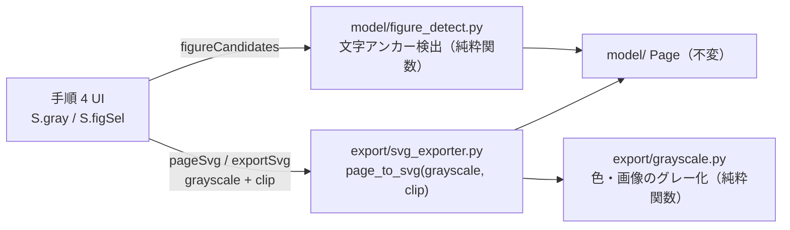

# PdfToSvg「スチュワードシップ図をグレースケールで書き出す」モード 設計書

- 作成日: 2026-09-04
- 対象: `pdf-to-svg/`（Python サーバ + 素の JS の Web UI）
- 状態: 設計確定（利用者承認済み）。実装計画は別ファイルで作成する。

## 1. 目的

三井住友トラスト・アセットマネジメントの運用報告書（例:
`https://www.smtam.jp/fund/pdf/_id_140823_type_k.pdf`）に毎号掲載される
「当社のスチュワードシップ活動」の図（螺旋の概念図。見出し帯・番号付きラベル・
基盤の帯・QR 枠を含む一まとまり）だけを切り出し、色をすべてグレースケールへ
変換した SVG として書き出す。同社の別ファンドの報告書（`_id_700001` / `_id_510186` /
`_id_140812` など）にも同じ図が載っており、それらへ同じ処理を無編集で適用できる
ことを要件とする。

成果物の主な行き先は Office への貼り付けと印刷であり、SVG フィルタに頼らず
色そのものを灰色にする。文字は文字のまま残す（検索・再編集可能）。

## 2. 利用者の動線

1. 手順 1「PDF を選ぶ」に、チェックボックス
   **「図だけをグレースケールで書き出す」** を追加する。取込の前後どちらでも
   切り替えられる（サーバ側の状態には影響しない）。
2. チェック ON で「次へ」を押すと、手順 2（用語を置換）・手順 3（削除・枠線の編集）を
   飛ばして手順 4 へ直行する。ステップバーは手順 2・3 を非表示にし、
   手順 4 の文言を「図をグレーで書き出す」に変える。
3. 手順 4 は 3 ペイン構成になる。
   - 左: ページレール（各ページの候補数バッジ。採用ありは緑）。
   - 中央: グレースケールのページプレビューに候補矩形を重ねる。
     点線 = 未採用の候補、実線 = 採用済み（外側を薄く遮蔽、角ハンドルで伸縮、
     × で採用解除）。空白部分をドラッグすると自前の矩形を追加できる。
   - 右: 件数、書き出し範囲（表示中のページの図 / 全ページの採用した図）、
     採用一覧（ファイル名と pt 寸法）、書き出しボタン。
4. 検出できたページの矩形は最初から採用済みにする。検出できなかったページは
   候補なしで始まり、手動ドラッグで追加できる。全ページで検出ゼロのときは
   中央に「図が見つかりませんでした。範囲をドラッグで指定してください」を出す。
5. 「SVG に書き出す」で採用した図を書き出す。1 個なら SVG を直接、複数は ZIP。

UI の見た目は設計時に作ったモック（Artifact「PdfToSvg 図グレー抽出モード」）に
従う。既存の `styles.css` のトークンと部品（`.stepbar` / `.editor` / `.panel` /
`.pagenav-rail` / `.segment`）を流用し、新しい配色は増やさない。

## 3. アーキテクチャ

既存の「model is truth」「SVG 出力は決定的」「PyMuPDF は `engine/pdf_engine.py` に
隔離」の原則を崩さない。図検出もグレー化も切り出しも**モデルを変更せず**、
書き出し時のオプションとして実装する。

## 4. 図検出 `src/model/figure_detect.py`（新設）

PyMuPDF に依存せず、`Page.live_elements()` の `TextElement` / `RectElement` /
`PathElement` / `LineElement` / `ImageElement` の bbox と文字列だけで判定する
純粋関数。合成した `Page` で単体テストできる。

### 4.1 判定手順

`detect_stewardship_figure(page) -> Rect | None`

1. **見出し**: 文字要素の `text` を NFKC 正規化し空白を除いた上で
   `当社のスチュワードシップ活動` を含む要素を探す。無ければ `None`。
2. **図ラベル**: 見出しより下（`bbox.y > 見出し.y`）で、幅がページ幅の 50% 未満で、
   次のキーワードのいずれかを含む文字要素を集める。
   `投資リターンの最大化` / `エンゲージメント` / `議決権行使` / `ESGの考慮` /
   `フィデューシャリー` / `stewardship_initiatives`。
   幅の条件は、同じ語が並ぶ直後の本文段落（ページ幅いっぱいの行）を除外するため
   （実 PDF では URL ラベルが幅 45.4%、本文段落は 84% 以上）。
   ラベルが **3 件未満**なら `None`（見出しだけで図が無い、または文言が大きく変わった）。
3. **領域**: ラベルの bbox を合併した矩形から始め、近傍 `FIGURE_EXPAND_TOL`（16pt）
   に触れる図形・画像（`RectElement` / `PathElement` / `LineElement` / `ImageElement`）を
   不動点まで取り込む。ただし面積がページの 50% 以上の要素（ページ背景）と、幅が
   ページ幅の 90% 以上の要素（ヘッダ帯・区切り罫）は取り込まない。
4. 最後に、領域に交差する幅 50% 未満の文字要素を取り込む（ラベルの説明文）。

返す矩形は 1 ページにつき最大 1 個。同じページに 2 回載ることは想定しない。

### 4.2 定数

キーワード集合と見出しは `figure_detect.py` の定数 1 箇所にまとめる
（`STEWARDSHIP_HEADING` / `STEWARDSHIP_LABELS` / `MIN_LABEL_HITS = 3` /
`FIGURE_EXPAND_TOL = 16` / `LABEL_MAX_WIDTH_RATIO = 0.5`）。将来別の図を狙うなら
定数集合を増やす構造にするが、今回は 1 集合のみ実装する。

### 4.3 資源上限

要素数は既存の `MAX_PAGE_ELEMENTS` の範囲内。不動点ループは「取り込んだ要素は
二度と候補にしない」形で書き、反復回数を要素数で上界する（必ず返る）。

### 4.4 実測

設計時に PyMuPDF 直叩きの試作で 5 本（80 ページ）を検査し、該当ページ 1 つずつを
検出、他 75 ページの誤検出ゼロ。掲載ページは 7〜10 ページ目と本ごとに違う。

| ファイル | 検出ページ | 矩形（pt） |
|---|---|---|
| `_id_140823_type_k` | p8 | 81,248 – 518,652 |
| `_id_140823_type_kr`（モノクロ版） | p10 | 52,138 – 468,515 |
| `_id_700001_type_k` | p7 | 81,276 – 518,679 |
| `_id_510186_type_k` | p9 | 81,276 – 518,679 |
| `_id_140812_type_k` | p8 | 81,248 – 518,652 |

これらの PDF は外部著作物なのでテストフィクスチャには入れない。テストは合成
`Page` で行う。

## 5. グレー化 `src/export/grayscale.py`（新設・純粋関数）

- `to_gray_color(value: str) -> str`: `sanitize_color` が許す形
  （`#rgb` / `#rgba` / `#rrggbb` / `#rrggbbaa` / CSS 色名 / `none` / `currentColor`）を
  受け、RGB を **Pillow の `convert("L")` と同じ固定小数点式**（ITU-R 601-2: `(R*19595 + G*38470 + B*7471 + 0x8000) >> 16`）で灰色にし
  `#rrggbb`（alpha があれば `#rrggbbaa`）で返す。`none` / `currentColor` は素通し。
  CSS 色名は `PIL.ImageColor.getrgb` で解決する。
- `to_gray_image(img_bytes: bytes, ext: str) -> tuple[bytes, str]`: Pillow で
  `L`（alpha ありは `LA`）へ変換し PNG で返す。`functools.lru_cache(maxsize=16)`。
  画素数が `MAX_RASTER_PIXELS` を超える、またはデコードできない画像は**原本を
  そのまま返す**（degrade。例外を外へ出さない。`Image.MAX_IMAGE_PIXELS` に頼らず
  自前で先に検査する）。
- ベクタと画像で同じ係数を使うので明度が揃う。SVG フィルタは使わない（Office は
  フィルタを無視してカラーのまま貼り付き、ブラウザ印刷は文字をラスタ化するため）。

## 6. エクスポータ `src/export/svg_exporter.py`

`page_to_svg(page, *, annotate=False, grayscale=False, clip: Rect | None = None)`

- `grayscale=True`: 色を出す箇所（`_paint` / 文字 `fill` / 罫線 `stroke` / 画像 /
  スキャン背景）に `to_gray_color` / `to_gray_image` を通す。実装は「塗り変換関数」を
  1 つ決めて各出力関数へ引数で渡す形にし、`if grayscale` を各所に散らさない。
- `clip` あり: `viewBox` と `width` / `height` を clip 矩形にし、clip に交差しない
  要素は出力しない。交差する要素のはみ出しは根直下の `<clipPath>` で切る
  （標準要素なので Office でも効く）。`clipPath` の属性も `_attr` 経由で組み立てる。
- 両方とも既定 OFF で、既存出力と**バイト一致**を保つ（`test_pipeline.py` 不変）。
  ON の出力も決定的（同一モデル → 同一 SVG）。
- `test_export_escaping.py` のソース走査ガードの対象に `grayscale.py` も入る
  （`src/export/` 配下）。属性値を f-string で組み立てない規律は同じ。

## 7. RPC `src/web/rpc_methods.py`（無状態）

| メソッド | 引数 | 返り値 |
|---|---|---|
| `figureCandidates`（新設） | `fileIndex`, `pageInFile` | `{rects: [{x, y, w, h}]}`（0 または 1 件） |
| `pageSvg`（引数追加） | 既存 + `grayscale: bool = false`, `clip: {x,y,w,h}`（省略時 null） | 既存と同じ |
| `exportSvg`（引数追加） | 既存 + `grayscale`, `clip`, `figIndex: int = 1` | `{svg, name}` |

- `clip` は数値 4 つを検証する（数値でない・負・NaN・ページ外は 400）。
- `exportSvg` のファイル名は `clip` ありのとき `<stem>_p<N>_fig<k>_gray.svg`
  （`k` は同ページ内の採用順、1 始まり）。ZIP 名（クライアント `zipName`）は
  `<stem>_gray_svg.zip`。Downloads でカラー版の `_p<N>.svg` と衝突させない。
- セッション状態は増やさない。モードはクライアントが持ち、毎リクエスト引数で渡す。

## 8. UI

### 8.1 状態（`state.js`）

- `S.gray: boolean`（既定 false）。
- `S.figCand["fi:pi"]: Rect[]`（検出候補。取得済みページのみ）。
- `S.figSel["fi:pi"]: Rect[]`（採用矩形。検出結果はここへ複製されるので、
  ハンドル操作で変えても候補は保たれる）。
- `S.zoomFor[4]` を追加。`svgCache` のキーに gray を含める（`fi:pi:g`）。
- 遷移: `tryNext` は phase 1 かつ `S.gray` のとき phase 4 へ（`S.page = 0`）。
  `back` は phase 4 かつ `S.gray` のとき phase 1 へ。ステップクリックは gray のとき
  1 と 4 のみ許す。`advancePhase` は変えない。
- 書き出し範囲は gray のとき `page`（表示中のページの採用図）と `all`
  （全ページの採用図）の 2 択。`noskip` / `spec` は非表示。
- 書き出し対象の列挙 `exportFigureList()`: 採用矩形を `{fileIndex, pageInFile,
  clip, figIndex}` に展開する（DOM 非依存。vitest で検証）。

### 8.2 描画（`app.js` / `index.html`）

- 手順 1: ドロップゾーン下にチェックボックス（ラベル・説明・省略される手順の表示）。
  ON のときステップバーの手順 2・3 に取消線と「手順 2・3 は省略されます」。
- 手順 4: gray のときだけ左ペイン（レール + エディタ）を表示する。エディタは
  手順 2・3 と同じ `mountPage`（`withSelect=false`）を使い、候補矩形は
  `[data-editor]` 相当のオーバーレイ要素として重ねる（保存には含まれない）。
- 候補のクリックで採用/解除。採用済みの角ハンドルをドラッグで伸縮。空白ドラッグは
  手順 3 の `installCropDrag` を phase 4 gray でも動かし、矩形追加へ倒す。
- ページ初表示時に `figureCandidates` を取得し、1 件あれば採用済みとして
  `S.figSel` に入れる（既に利用者が触ったページは上書きしない）。
- 右ペインの件数は採用矩形の総数。0 件のとき書き出しボタンは無効。
- 手順 4 の書き出しサマリは gray のとき「N ファイル・全 M ページ・採用 K 図」。

## 9. エラー処理

- 図検出の例外はページ単位で握り、候補なしとして返す（1 ページの想定外で全体を
  止めない）。サーバログには残す。
- 画像のグレー化失敗は原本を返す（第 5 節）。
- `clip` 不正は 400 で返し、クライアントはトーストで通知する。
- 書き出し 0 件は UI で防ぐ（ボタン無効）。

## 10. テスト（TDD で先に書く）

- `test/test_figure_detect.py`: 合成ページで①見出し + ラベル 5 + 帯・曲線・QR 枠 →
  1 矩形、②見出しのみ → None、③ラベル 2 件 → None、④本文段落（幅 80%）だけが
  キーワードを含む → None、⑤ページ背景（面積 60%）は取り込まない、
  ⑥ヘッダ帯（幅 95%）は取り込まない、⑦不動点ループが要素数で止まる。
- `test/test_grayscale.py`: 色の各形式・alpha 保持・色名・`none` / `currentColor`、
  画像 RGB→L / RGBA→LA、巨大画素は原本、壊れたバイトは原本、`lru_cache` の効き。
- `test/test_export_clip.py`: `clip` の `viewBox` / `width` / `height`、交差外の要素が
  出ない、`<clipPath>` の存在と `_attr` 経由、`grayscale=True` の出力にカラー hex が
  残らない、既定 OFF が従来出力とバイト一致、ON の決定性。
- `test/test_web_rpc.py`: `figureCandidates` / `pageSvg` / `exportSvg` の引数検証と
  ファイル名。
- `test/test_pdftosvg_state_js.py`: gray の遷移（1→4、4→1、ステップ可視）、
  `exportFigureList`、`zipName` の gray 名。
- `test/test_pdftosvg_app_flow_e2e.py`: チェック ON → 手順 4 直行 → 候補が採用済み →
  書き出しファイル名に `_fig1_gray` が付く。合成 PDF フィクスチャ（見出し + ラベル +
  図形）を `test/fixtures/` に追加する。

## 11. ドキュメント

通常の日本語で、既存の文体に合わせて更新する。

- `docs/pdf-to-svg/src/設計正典.md`: 中核原則に「図検出は model 層の純粋関数で
  fitz 非依存」「グレー化・切り出しは exporter のオプション。モデル不変・
  クライアントで SVG を書き換えない・SVG フィルタ不使用」を追記。
- `docs/pdf-to-svg/src/設計書.md`: 図検出・グレー化・clip の各節。
- `docs/pdf-to-svg/src/PdfToSvg_仕様一覧.md`: 画面項目・入出力・RPC の 3 表。
- `docs/pdf-to-svg/src/操作手順書.md`: 手順 1 のチェックと手順 4 の図選択。
- `README.md`: 機能一覧の 1 行。
- 手引きのスクリーンショット再撮影は自動化されていないため、文言更新を先行し
  撮影は別タスクとして扱う。

## 12. スコープ外（今回はやらない）

- スチュワードシップ図以外の汎用図検出（強調ボックスの誤検出が多く、候補提示に
  向かない）。
- キーワード集合の UI からの編集。
- 通常モード（カラー）の手順 4 へのプレビュー追加。
- グレー化と編集（用語置換・削除）の併用。

## 13. 前提

- 基点: `fix/pdf-to-svg-protected-pdf` を `main` へ fast-forward マージ済み。
  作業ブランチは `feat/pdf-to-svg-stewardship-figure-gray`。
- Pillow は `requirements.txt` に宣言済み（12.3.0）で、本設計で初めて使う。
  配布物（PyInstaller onedir）に含まれることを `scripts/build.bat` で確認する。
